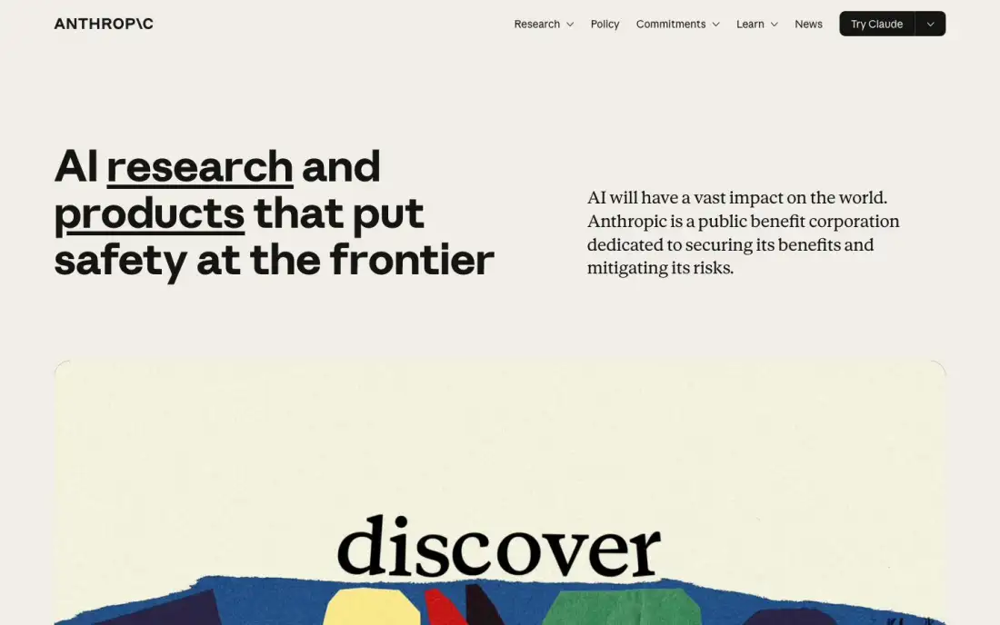
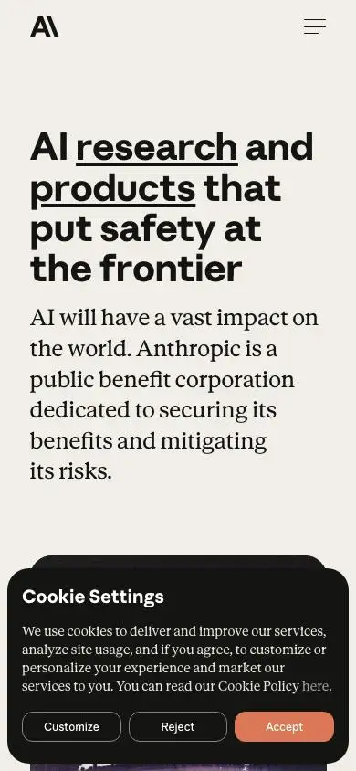

# Anthropic — technical reference report

## 1. Snapshot
- **URL:** https://www.anthropic.com/ · **Captured:** 2026-09-23
- **Pages captured:** home, /research, /engineering, /science, /policy, /constitution
- **Stack:** home = **Webflow** + GSAP + 1 `<video>` (hero). Subpages = **Next.js** (a hybrid stack: marketing home on Webflow, content sections on Next). Fonts: Anthropic Sans (display) + Anthropic Serif (body); on Next the names are anthropicSans/anthropicSerif.
- **Verdict:** The reference for a "humanist, editorial" AI brand. Warm paper palette, serif body copy, hand-made collage/illustration and almost no product UI. Brand-led rather than conversion-led. Very light pages.

## 2. Positioning & messaging
- **5-second test:** "an AI research + products company whose differentiator is safety". Stated plainly by the H1 plus a serif mission paragraph (home-fold). Product specifics (Claude) are pushed to the nav CTA "Try Claude".
- **H1:** "AI research and products that put safety at the frontier" (~61px, w700). "research" and "products" are underlined links inside the H1 (dual-audience routing inside the headline).
- **Subhead (serif, right column):** "AI will have a vast impact on the world." (then the PBC mission sentence).
- **Value-prop structure:** mission claim → cinematic brand video card → "Latest releases" (3 model cards) → values statement ("we build AI to serve humanity's long-term well-being") with an index list of flagship documents.
- **Voice:** measured, principled, visionary-but-sober. Long-form serif prose. Humility markers ("mitigating its risks").

## 3. Information architecture
- **Primary nav:** Research ▾, Policy, Commitments ▾, Learn ▾, News | **Try Claude** (split button with ▾ dropdown to product choices).
- **Mega-menus (from extract):** Research → Overview, Alignment, Economics, Engineering, Frontier Red Team, Interpretability, Science, Societal Impacts. Commitments → Constitution, Transparency, RSP, Security and compliance… Learn → Academy, Tutorials, Use cases, Developer docs. Company → About, Leadership, Careers.
- **Mobile:** "A\" monogram logo plus hamburger only (home-mobile-fold).
- **Footer:** dark (rgb 20,20,19) mega-footer with columns Products, Models, Solutions (≈20 industries), Claude Platform, Resources, Programs, Help and security, Company, Terms and policies. Monogram left, socials bottom-left (home t01).
- **Page types:** brand home, section landing (research/science/policy) = H1 + serif intro + team grid + featured + dated list; engineering blog index; long-form document (/constitution, 30k words, sticky TOC plus PDF/ePub/audiobook downloads).
- **Sitemap sketch:** `/` → `/research` (teams), `/engineering`, `/science`, `/policy`, `/constitution`, `/news`, plus the claude.ai product surfaces via the Try Claude dropdown.

## 4. Home page anatomy
| # | Section | Job | Layout | Visual device | CTA |
|---|---|---|---|---|---|
| 1 | Hero | Mission claim | 2-col: bold sans H1 left / serif paragraph right | Text (underlined in-H1 links) | Try Claude (header) |
| 2 | Brand film card | Emotion / "discover" | Full-width rounded card | Autoplay **video** of paper-collage/painted typography ("discover", "more to…" frames differ between captures) | — |
| 3 | Latest releases | Product momentum | 3 equal tan cards | Text + spec table (DATE / CATEGORY / DETAILS in mono) | "Read announcement →" (black pill per card) |
| 4 | Values + index | Credibility / depth | Left statement, right ruled list (title ↔ category) | Text list | Row links |
| 5 | Footer | Navigation | Dark, 5 columns | Monogram | Links |

## 5. Visual system
- **Type:** 2-family system: **Anthropic Sans** (display, bold 700, H1 60.9px/67px ≈1.1 lh, normal tracking) + **Anthropic Serif** body at **20px** on home (16px on subpages). Mono for spec labels (DATE/CATEGORY). Subpage H1 52px/57.2px w700.
- **Color:** bg rgb(250,249,245) warm off-white (home body rgb(240,238,230)-ish visual), fg rgb(20,20,19). Warm greys 176,174,165 and 94,93,89. Card tan ≈ rgb(227,218,204). Accent **clay/terracotta** rgb(217,119,87) / rgb(198,97,63), used sparingly (cookie "Accept" button). Illustrations bring the rest of the color. 1 warm accent plus warm neutrals.
- **Light/dark:** **light-only.** The darkpref fold is identical except the video frame (home-darkpref-fold). No toggle. The footer and "Join the team" bands are dark, which gives a dark rhythm without a theme.
- **Grid/whitespace:** ~78–84px gutters, 12-col feel, generous but denser than Linear. Hairline dividers between list rows.
- **Imagery:** hand-cut paper collage, painterly textures, bold black ink glyph illustrations (engineering featured art: nodes, triangle, flask; p2 fold), data-art (research fold: colored exponential line bundles). Zero stock photos, zero product screenshots.
- **Borders/radii:** ~16–24px radii on media and cards, no shadows, 1px rules. Button radius ~6px.

## 6. Motion & interaction
- GSAP on the Webflow home (likely text/card reveals) plus one autoplay brand video in the hero card (the frame changes between captures). No WebGL/canvas.
- Subpages: static. Constitution uses a sticky left TOC with active-state highlighting (p5 fold).
- Perceived weight: light. The video is the only heavy asset (home ~1.64MB, 22 requests).

## 7. Conversion design
- **Single commercial CTA:** "Try Claude" split button (primary black) in the header on every page; the dropdown chooses the product. Mobile hides it behind the hamburger.
- Secondary CTAs are contextual: "Read announcement" (cards), "Start building" + "Developer docs" (engineering header, p2 fold), "See open roles" (research/science dark closing band "Join the Research team", p1 t01), "Download PDF/ePub", "Listen to the audiobook".
- **Forms:** none except the cookie preference checkboxes.
- **Audience paths:** in-H1 links (research vs products), nav segmented by reader type (researchers, policymakers, learners, developers, buyers → Try Claude).

## 8. Trust & proof
- No logos or testimonials on home. Trust is **institutional**: public-benefit-corporation statement, Responsible Scaling Policy, Constitution, Transparency, "Security and compliance" in nav and footer, published research with dates and team attribution.
- Proof = publishing cadence (dated release cards, dated research list).

## 9. Pricing presentation
- Not captured (pricing lives on the Claude product surfaces; linked in footer).

## 10. Content hub / blog
- **/research:** H1 + serif intro + "Research teams" inline links → 5-col team grid → featured post (large data-art image left, dated post list right) → "Publications" table (date · team · title) with "See more ↓" → dark careers band (p1 fold, t01).
- **/engineering:** compact H1 band with "Start building"/"Developer docs" buttons, a thick rule, then Featured (ink illustration + large title + serif dek) and a list of titles with right-aligned dates, no thumbnails (p2 fold).
- **Card/row anatomy:** title-first, date always visible, team/category as taxonomy; authors not shown in the lists.
- **Long-form:** /constitution is a 63,000px single page with sticky TOC plus multi-format downloads. A model for pillar content.

## 11. Technical & SEO
- **Titles:** `Page \ Anthropic` (backslash brand separator mirrors the logo): "Research \ Anthropic", "AI policy \ Anthropic". Home title "Home \ Anthropic" is weak.
- **Meta description:** the same generic company sentence is reused on research/engineering/science/constitution (duplicate meta: an SEO flaw). Policy has a unique one.
- **OG:** one shared OG image across section pages; the constitution has its own. summary_large_image.
- **Canonical:** self. **hreflang:** none. **JSON-LD:** none on any captured page.
- **Headings:** home H1 is duplicated in DOM text (animation split). /engineering has **no H1** (h1 empty; the title is an H2), a hygiene miss.
- **Perf (rough):** the leanest of the group: 22–44 requests, 0.7–1.6MB, 0.9–2.6s load; DOM 528–1,272 nodes.
- **Mobile:** H1 reflows to 4 lines with the serif subhead full-width (home-mobile-fold). The cookie banner covers ~30% of the mobile fold.
- **Cookie consent:** bottom-right modal "Cookie Settings" with **Customize / Reject all / Accept all**, equal-weight Reject (home-darkpref-fold). An LGPD-grade reference.
- **A11y:** "Skip to main content" + "Skip to footer" links. Serif body at 20px with high contrast. Underlined links inside the H1 are clear affordances.

## 12. Steal / Adapt / Avoid for NoctusAI
- **[STEAL]** Consent banner with equal-weight "Rejeitar todos / Personalizar / Aceitar todos" before GA4/Meta Pixel. Matches NoctusAI's LGPD + opt-in analytics decision exactly.
- **[STEAL]** Dated "Latest releases" cards with a mono spec table (DATA / CATEGORIA / PRODUTO). Honest momentum proof that needs no testimonials. Fits the "no social proof yet" constraint.
- **[STEAL]** In-H1 links for dual audiences ("produtos prontos" / "soluções sob medida" underlined inside the H1). Encodes the NoctusAI hybrid positioning in the headline itself.
- **[STEAL]** Two-family type system (sans display + readable body) with a single warm accent. Gives a distinctive voice for a full rebrand.
- **[ADAPT]** Values/principles index list (title ↔ category rows): reuse it for "Como trabalhamos" (LGPD, dados no Brasil, IA responsável) as trust substitutes until real proof exists.
- **[ADAPT]** Long-form pillar page with sticky TOC plus PDF download: a model for SEO pillar content in the blog ("Guia de IA para imobiliárias").
- **[ADAPT]** Split "Try Claude ▾" button → "Começar ▾" listing each vertical SaaS product; routes the hybrid catalog from one header CTA.
- **[AVOID]** Light-only with no darkpref support: NoctusAI is committed to theme-aware.
- **[AVOID]** Duplicate meta descriptions, missing H1 (/engineering), zero JSON-LD: all contradict SEO-first. Enforce unique meta + single H1 + schema per template.
- **[AVOID]** Mixed Webflow + Next.js stacks for one site: two design systems to keep in sync. NoctusAI should ship one prerendered stack.
- **[AVOID]** No product imagery at all: works for a lab brand, but NoctusAI sells concrete vertical SaaS to SMBs who need to see the product.
