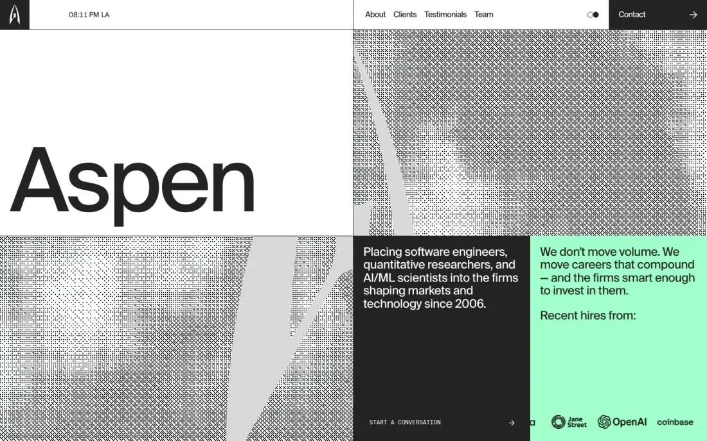

# Aspen Search — aspensearch.com (Awwwards SOTD 2026-09-15)

> Tile note: tile numbering is non-linear (home-t06 is a full-page thumbnail; t00 overlaps t02). Tiles are cited by filename; section order below is taken from the thumbnail (home-t06).

## 1. Snapshot
- **URL:** https://www.aspensearch.com/ · **Captured:** 2026-09-23
- **Pages:** home only (single-page site; nav anchors About/Clients/Testimonials/Team)
- **Stack (detected):** Next.js, Sanity CMS (OG image host), Lenis smooth scroll, **5 WebGL canvases** (dithered/halftone image shaders), a theme toggle (`themeToggle:true`), no GSAP/video. Fonts: Suisse Int'l + Suisse Int'l Mono only.
- **Verdict:** A Swiss-grid "editorial terminal" built from two fonts, one mint accent and a dither shader. The wow comes from typography scale and the halftone WebGL texture, not from 3D. The style is very reusable, but the mobile capture reveals animation-state risks.

## 2. Positioning & messaging
- **5-second test:** partial. The giant "Aspen" wordmark (H1) says nothing by itself. Meaning arrives in the adjacent dark cell: "Placing software engineers, quantitative researchers, and AI/ML scientists…" plus the mint cell "We don't move volume…" (home fold). That fold is legible in about 3s because it's split into cells.
- **Voice:** boutique and blunt, anti-volume ("Small team. High Signal.", "No… spray-and-pray" in home t04). Short declaratives, and confident numbers ("500+ placements", "$1M–5M range of recent offers", "19+ years", home t01).

## 3. Information architecture
- **Nav (home fold):** logo cell · a live clock ("08:11 PM LA") · About / Clients / Testimonials / Team · theme toggle (two dots) · a black "Contact →" block.
- **Footer (home t05):** a giant "LETS START A CONVERSATION" typographic CTA over halftone; "Raise your trajectory"; anchor links; NYC/LA live clocks; email + LinkedIn.
- **Page types:** a single long page (height 10,847px).
- **Sitemap sketch:** `/` (#about, #clients, #testimonials, #team, #contact). No blog, no subpages.

## 4. Home page anatomy
| # | Section | Purpose | Layout pattern | Visual device | CTA |
|---|---|---|---|---|---|
| 1 | Hero (fold) | Brand + offer | 4-cell grid: wordmark cell, halftone cell ×2, dark statement cell, mint cell with scrolling logo marquee | Dithered WebGL image of the "A" logo mark; the H1 animates "Aspen" → "Search" (two H1s in DOM) | START A CONVERSATION → |
| 2 | "Search / PLACING WINNERS." (t06) | Wordmark continuation | Full-width type bands | Oversized type | — |
| 3 | About (t01) | Story + stats | Sticky label left, long paragraph right, then stat cells | Stat blocks in dark / mint / grey cells (500+, $1M–5M, 19+) | — |
| 4 | CONNECTING TOP-TIER TALENT (t02, t00) | Practice areas | Left grey block with huge uppercase H2; right dark column of 4 numbered practice rows | Thin-line generative line-art glyph per practice (torus, sphere, radial burst, orbit); mono bullet lists with mint squares | TALK TO A PARTNER → |
| 5 | Clients (t00, t03) | Proof | Huge "Clients" word + halftone panel; list of client names with sector tags; a blue client-logo card with 01–06 pager | Name-list as typography, sector in mono | WORK WITH US → |
| 6 | Testimonials (t03, t04) | Proof | Quote cell + meta cell (position, company) + a photo carousel with arrow cells | Real headshot photo | — |
| 7 | Team (t04, t05) | Humanise | Huge "Team" word; "Small team. High Signal."; a grid of halftone portraits with role tags and mint name bars | Portraits rendered as dither; name → link | per-person → |
| 8 | Contact CTA / footer (t05) | Convert | Full-bleed halftone with knocked-out giant type blocks | Type as a button (mint arrow cell) | LETS START A CONVERSATION → |

## 5. Visual system
- **Typography:** H1 is suisseIntl **180.7px / 180.7px lh, weight 450, tracking −4%**. Section titles ("Clients", "Team", "CONNECTING TOP-TIER TALENT") are ~150–180px. Body is 16px, with larger lead paragraphs ~30px. Mono is used for labels, bullets, buttons and the clock. **Two families total.** Type *is* the hero.
- **Color:** ink `#232323` (×456), white, one accent **mint `#A1FFCB`**, light grey `#D9D9D9`/`#E0E0E0` cells, plus a single client-brand blue card. Accent use is rationed (one stat cell, name bars, bullet squares, CTA arrow).
- **Light/dark:** an explicit toggle is present in the nav. prefers-color-scheme dark rendered the same light page (home-darkpref-fold), so the site ignores the OS preference and only changes theme via the user's click. The dark-mode palette wasn't captured.
- **Grid/whitespace:** a strict 4-col (360px) visible grid with 1px hairline cell borders. Every element snaps to a cell, and large empty cells are intentional.
- **Imagery:** everything photographic is passed through a **halftone/dither WebGL shader** (logo mark, abstract textures, team portraits). The one exception is the testimonial carousel photo (t04), which is shown raw.
- **Iconography:** generative thin-line geometric glyphs (t02), arrow glyphs, filled square bullets.
- **Radii/elevation:** zero radii, zero shadows. Hard edges only.

## 6. Motion & interaction
- **Observed:** 5 WebGL canvases, i.e. per-image dither shaders (hero, section panels, portraits). A logo marquee in the mint hero cell (logos cut off mid-scroll in both folds). A live clock. Theme toggle. Carousels with arrow cells. Lenis smooth scroll.
- **Observed via capture artifacts (mobile):** home-mobile-fold is a **solid dark screen** (an intro/preloader not yet dismissed). In home-mobile-t01, stat numbers render as "000+" and "$(M-0M": **odometer/slot counters caught mid-animation**, and the about paragraph area is blank (scroll-reveal not fired). Any non-scrolling agent (crawler screenshot, social preview, Lighthouse filmstrip) can therefore see wrong numbers or blank blocks.
- **Inferred:** the dither probably reacts to cursor or scroll (a standard pattern for per-image shader canvases). The H1 probably flips Aspen/Search.
- **Weight:** 7.7s load, 62 requests, ~0.6MB, 1,708 DOM nodes. That's moderate: the shader approach is cheap compared with 3D models.

## 7. Conversion design
- One conversion intent, "start a conversation", repeated at least 5 times with varied labels (START A CONVERSATION, TALK TO A PARTNER, WORK WITH US, Contact, final giant CTA). No forms: it ends in a **mailto and LinkedIn** (t05). Low friction, but untracked.
- CTA styling is consistent: a black mono-label block with an arrow, or a mint arrow cell.

## 8. Trust & proof
- A marquee of employer logos ("Recent hires from": Jane Street, OpenAI, Coinbase, Stripe…); a named client list with sector tags; quantified stats; testimonials with role + company; a named team with photos. The proof is dense but set typographically, so it doesn't feel like a logo wall.

## 9. Pricing
- Not applicable / not captured.

## 10. Content hub / blog
- None.

## 11. Technical & SEO
- **Meta:** a good descriptive title and meta; canonical set (apex, while the capture was on www, so the redirect is consistent); OG via Sanity; twitter large card; **no hreflang**; JSON-LD WebSite + WebPage only (no Organization/LocalBusiness, which is a miss for a services firm).
- **Headings:** **two H1s** ("Aspen" ×2, from the animated wordmark); each H3 duplicated (desktop + mobile DOM variants); "Team" H2 duplicated. The H1 contains only the brand word, with no keyword.
- **Text in canvas:** body text is HTML, while imagery is canvas. The dithered team portraits are canvases, so any alt text depends on fallback markup (not verifiable, and an a11y risk).
- **Perf:** see §6. Word count 938.
- **Mobile:** the preloader and counters make the first view empty. Layout collapses to a single column of stacked cells (mobile t01).
- **Reduced motion:** not verifiable. The counter and preloader patterns need `prefers-reduced-motion` and no-JS fallbacks that render final values.

## 12. Steal / Adapt / Avoid for NoctusAI
- **[STEAL]** Type-as-hero at ~180px with tight tracking and a 2-family system (grotesk + mono). It's a strong rebrand signature at near-zero perf cost, and prerenders as plain HTML.
- **[STEAL]** A visible hairline cell grid with rationed accent cells. It makes admin-toggled home sections (products, custom builds, proof, pricing) visually modular: hiding a cell doesn't break the composition.
- **[ADAPT]** Halftone/dither shader over images as the "minimal motion elsewhere" layer. Implement as progressive enhancement over a static `` (with alt) so SEO and a11y survive. It can double as the WebGL poster-frame treatment.
- **[ADAPT]** Numbered practice rows with generative line glyphs, used as the NoctusAI product vertical list (01 ERP Imobiliário, 02 Terapia…) with mono capability bullets.
- **[ADAPT]** The giant typographic closing CTA, pointed at WhatsApp (prefilled) instead of mailto, with analytics fired only post-consent.
- **[ADAPT]** Honour prefers-color-scheme on first load *and* offer the toggle. Aspen ignores the OS setting, and NoctusAI needs both.
- **[AVOID]** Odometer counters and scroll-reveal without a final-state SSR fallback: the capture showed "000+" and blank blocks. Prerender the final values; animate only as enhancement.
- **[AVOID]** A preloader that blanks the mobile fold. It kills LCP and Lighthouse ≥90.
- **[AVOID]** Duplicate/brand-only H1s and duplicated responsive DOM. Use one keyword-bearing H1 per page.
- **[AVOID]** A logo marquee of third-party brands (hiring logos). NoctusAI has no such proof yet, so don't imitate the pattern with placeholders.
