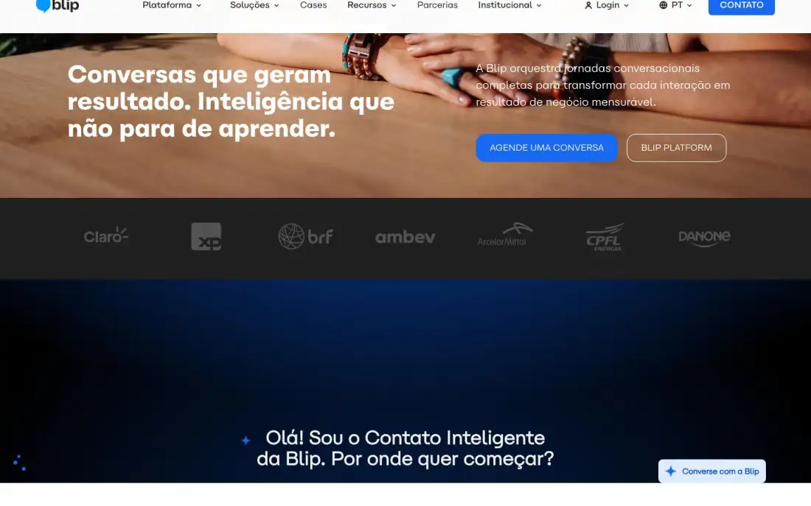
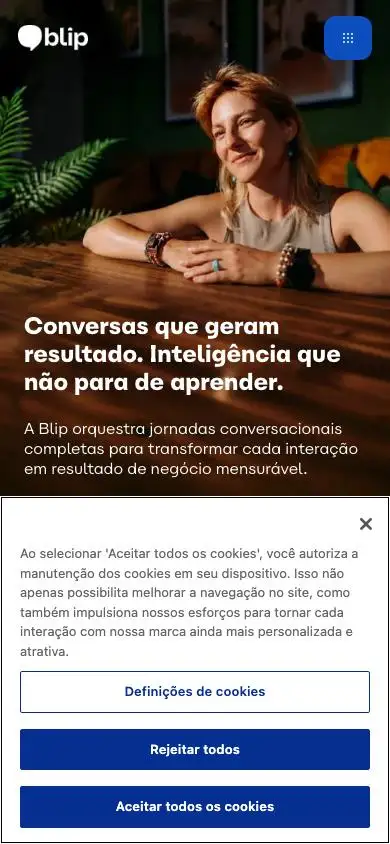

# Blip: technical reference report

## 1. Snapshot
- **URL:** https://www.blip.ai/ · **Capture date:** 2026-09-23
- **Pages captured:** home · `/cases/` (p1) · `/partners/` (p2, legacy sub-site) · `/contato/` (p3) · `/plataforma-blip/` (p4) · `/plataforma-blip/escute/` (p5, pillar subpage)
- **Stack:** WordPress (`/wp-content/uploads`) with HubSpot forms (`hs_context` and `0-1/` field names), a OneTrust consent manager (`id_onetrust` hidden field and the banner style), and a custom "Carbona Blip" variable font. No framework, WebGL, GSAP or Lottie detected. Home runs **88 scripts and 319 requests**.
- **Verdict:** The BR **conversational-AI enterprise** reference. It is photo-led and dark/light banded, with an **inline AI-assistant prompt as a home section**, WhatsApp as the product itself, and heavy enterprise proof. Its visual polish is high, but the SEO and heading hygiene is weak.

## 2. Positioning & messaging
- **5-second test (darkpref fold):** A full-bleed warm lifestyle photo (a smiling woman at a table), with the bottom-left headline "Conversas que geram resultado. Inteligência que não para de aprender." and a right column that reads "A Blip orquestra jornadas conversacionais completas…". Under it sit "AGENDE UMA CONVERSA" (solid blue) and "BLIP PLATFORM" (ghost). The category (conversational AI), the outcome and the enterprise tone are clear. The product itself is not shown.
- **H1:** as above, Carbona Blip 44/48 w800 in white over the photo.
- **Value-prop structure:** outcome ("resultado"), then a learning AI, then a full-journey flywheel (**Escute → Atraia → Interaja → Converta**, the nav's numbered 01–04 items and p4's orbit diagram), then proof (cases with %).
- **Voice:** confident and business-results oriented, with some visionary tone. Short declaratives. Uppercase CTAs. "Conversa" is repeated as the brand motif ("Agende uma conversa" instead of "demo").

## 3. Information architecture
- **Primary nav (fold):** Plataforma ▾ · Soluções ▾ · Cases · Recursos ▾ · Parcerias · Institucional ▾. The Plataforma mega-menu uses the **numbered journey** ("01 · Escute ›", "02 · Atraia ›"…). Soluções covers Stilingue, Professional Services, Blip Cred, **Blip Go ("Vendas e atendimento no WhatsApp para pequenos negócios")**. Recursos covers Blog, Reports, Ferramentas, Blip Store, Academy, Community, Eventos, Status, Documentação, Central de Ajuda.
- **Utility:** "Login ▾" (multiple products), a "PT ▾" language switcher (Português/English/Español radio list), and the **"CONTATO"** solid blue button. An event promo ("GARANTA SEU INGRESSO", H2 "O maior evento de Inteligência Conversacional do mundo") sits inside the nav or promo layer.
- **Footer (p3 full):** logo, "Fale com nosso time Comercial por telefone ou WhatsApp:", the "AGENDE UMA CONVERSA" button, socials, then 4 columns (Plataforma Blip, Soluções, Recursos, Institucional with Portal de Privacidade, Cookies, Código de conduta, Canal de Ética) and a bottom bar with the legal entity, **CNPJ** and two addresses (BH and São Paulo).
- **Page types:** pillar/platform page (p4), journey-stage subpage (p5), cases index with filters (p1), multi-step contact (p3), partner program (p2, **a legacy WordPress theme with a different header, green "Fale com a gente" button and old footer**).
- **Sitemap sketch:** `/` → `/plataforma-blip/{escute,atraia,interaja,converta}/` · `/solucoes/*` · `/cases/` (+ case detail) · `/partners/` · `/contato/` · `/blog/` · docs/academy/status on sub-domains · `/es/`, `/en/` mirrors.

## 4. Home page anatomy
| # | Section | Purpose/job | Layout pattern | Visual device | CTA in section |
|---|---|---|---|---|---|
| 1 | Hero (darkpref fold) | Category plus outcome | Full-bleed photo, headline bottom-left, copy and CTAs bottom-right | Warm lifestyle photography, white type, transparent nav over the image | "AGENDE UMA CONVERSA" / "BLIP PLATFORM" |
| 2 | Logo strip (fold) | Instant enterprise proof | Dark-grey full-width band | Greyscale logos (Claro, XP, BRF, Ambev, ArcelorMittal, CPFL, Danone) | n/a |
| 3 | "Olá! Sou o Contato Inteligente da Blip" (fold, home full) | **The AI agent as a section**, with an ask-anything entry | Full-bleed navy-to-black radial gradient, centered prompt | Sparkle icon, single input "Faça alguma pergunta…" | Free-text question |
| 4 | "Do primeiro contato ao pós-venda" (t01) | Use cases in WhatsApp | Text left, 2 phone-mock cards right | WhatsApp-style chat mocks ("Catálogos de produtos", "Pagamentos por WhatsApp") | "VER DEMONSTRAÇÕES" |
| 5 | "Conheça os segmentos em que atuamos" (t01) | Segment routing plus case | Dark band: segment list at left (Varejo/Financeiro/Serviços/Educação), portrait with chat bubbles in the middle, case at right | Chat bubbles overlaid on a portrait; client logo chip | "LEIA O CASE COMPLETO" |
| 6 | Security (t00) | Enterprise risk removal | 2 image cards at left, copy at right | ISO 27001 seal on a photo; Google/Meta/Microsoft chips | "CONHEÇA O PORTAL DE SEGURANÇA" |
| 7 | "Reconhecida por quem mais importa" (t00) | Awards | 6 circular badges | Prêmio Consumidor Moderno, WhatsApp Partnership Lighthouse Award (Meta), MelhorRH, Glassdoor, Endeavor, **Reclame Aqui RA1000** | "CONHEÇA A BLIP" |
| 8 | Blog (t02–t03) | Content hub | Blue gradient band; one large feature at left, 3 list cards at right | Tag chip, date, "min de leitura" | Card click |
| 9 | FAQ (t03) | Objections | Title left, numbered pill accordions right | "1. O que é a Blip?", "2. A Blip é confiável?" | "Ver mais" |
| 10 | Newsletter (t03) | Opt-in lead capture | Dark half with form, photo half | Brand logo over a metro-station photo | "PREENCHER PARA ENVIAR" (disabled until valid) |
| 11 | Footer | Links, contact, legal | 4 columns plus a contact block | CNPJ, addresses | "AGENDE UMA CONVERSA" |
| n/a | Floating (fold) | Always-on agent | Bottom-right pill | Sparkle icon | "Converse com a Blip" |

## 5. Visual system
- **Typography:** "Carbona Blip", a custom variable geometric sans used for everything display. The H1 is heavy (w800, 44/48, normal tracking). Section H2s are about 36px bold, with a **blue-colored phrase** for emphasis ("trabalhando pelo seu resultado", t01). Body uses the system font stack (`-apple-system`, 16px). Buttons are UPPERCASE with light weight.
- **Color:** blue `#1968F0` (primary) and `#375EFB` (buttons), near-black `#1F1F1F` / `#242426` bands, `#F5F5F5` light-grey bands, white, and deep-navy radial gradients (`#072F73` → black) for the "AI" moments. About 2 hues (blue plus neutrals). It is very disciplined.
- **Light/dark:** darkpref shows no change and there is no theme toggle. The page **alternates light and dark bands** (hero photo, dark logos, navy AI prompt, white, dark segments, light grey, white, blue, white, dark), so it already carries both palettes. That is a useful precedent for a theme-aware design.
- **Grid/density:** contained grid of about 1200px with 120px side margins. Big section padding. Home is 8k px long with only 567 words, which is low-density and visual.
- **Imagery:** premium, warm, **diverse Brazilian lifestyle photography** (real people, natural light), plus WhatsApp chat UI mocks overlaid on photos. No illustration style and no 3D.
- **Iconography:** minimal line icons, circular award badges and a sparkle "AI" glyph.
- **Radii/elevation:** cards at about 16–20px radius, pill buttons at 8px, almost no shadows. Contrast comes from band color changes, not elevation.

## 6. Motion & interaction
- No detected libraries or canvas. Interaction patterns: the segment tab switcher (t01, with the active item bolded), FAQ accordions, carousel-like case modules, mega-menus, the AI prompt input and floating agent, and a **multi-step contact form with a progress bar** (p3). The p4 platform page has a static "orbit" diagram (4 journey cards around the logo on a dark radial gradient) that suggests hover states.
- **Perceived weight:** visually calm, but the network is heavy (home 17.6s load, 319 requests, about 9.3MB). This is third-party script bloat (HubSpot, OneTrust, chat, analytics).

## 7. Conversion design
- **CTA types:** "AGENDE UMA CONVERSA" / "CONTATO" (sales, primary everywhere) · "BLIP PLATFORM" / "CONHEÇA A PLATAFORMA" (explore) · "VER DEMONSTRAÇÕES" · "LEIA O CASE" · the security portal · newsletter · Login. **There is no free trial or self-serve sign-up on the enterprise site.** SMB self-serve lives in "Blip Go" (menu).
- **Sticky:** a transparent-over-hero header with the "CONTATO" button, plus the floating **"Converse com a Blip"** agent (fold). On p1, p2 and p3 the agent pops a proactive bubble ("Olá, sou o Contato inteligente da Blip. Como posso te ajudar?") with **quick-reply chips** ("Quero conhecer a plataforma", "Saber mais sobre os planos").
- **WhatsApp:** it is the product's core channel (chat mocks everywhere). The footer says to contact sales "por telefone ou WhatsApp", but no wa.me floating button was captured. The agent is the chat surface.
- **Forms:**
  - Newsletter (home t03): nome, e-mail, **phone with a BR flag and +55 country picker**, **Segmento da empresa** (select), and an explicit **opt-in checkbox** plus LGPD purpose text.
  - Contact (p3): a multi-step HubSpot form. Step 1 is name, **e-mail corporativo**, phone +55, consent. Later steps (per the extract) ask for **cargo**, website, **número de funcionários**, **segmento de atuação** and **dor do negócio** (9 checkboxes). A progress bar, "CONTINUAR", and "PRONTO! ESPERAR CONTATO".
  - No CNPJ is asked.
- **Paths per audience:** by journey stage (Escute/Atraia/Interaja/Converta), by segment (home t01 tabs; partner page by vertical), by company size (Blip Go for SMB vs Platform for enterprise), and a partner track (V.A.R / Reseller / Service / Referral, p2).

## 8. Trust & proof
- Logo walls: the home strip, a 12-logo grid on contact (p3) and a 15-logo grid on p4 (Itaú, Coca-Cola, Danone, Wellhub, Smart Fit, Santander, Renner, Nestlé…).
- **Metric-headline cases:** "Stellantis… 80% de resolutividade", "YDUQS cresce 50% em matrículas", "Leroy Merlin 220% de ROI". The cases index (p1) has metric-first cards with vertical and channel tags and filters (Departamento, Segmento, Canal).
- Platform stats (p4): "+20BI mensagens/ano", "+400 clientes enterprise", "+30 países", plus before/after ops metrics (−33%, −73%, −14%, +50%).
- Security: ISO 27001, the Meta/Google/Microsoft/Apple partnerships and a dedicated security portal.
- **BR-specific:** **Reclame Aqui RA1000** certification badge, Prêmio Consumidor Moderno, the Meta WhatsApp partner award, CNPJ in the footer, BH and SP addresses.

## 9. Pricing presentation
- None on captured pages. The enterprise contact-led model means prices are never shown (the agent quick-reply "Saber mais sobre os planos" routes to sales). The p2 partner page mentions a plans link in its legacy nav.

## 10. Content hub / blog
- A home blue band (t02–t03) shows 1 feature plus 3 list cards with a category chip (SOLUÇÕES, ATENDIMENTO, WHATSAPP), date and reading time. It is thematically aligned with the product (AI agent, WhatsApp recompra, "O que é Inteligência Artificial?"). A typo is visible in a tag ("WHATASAPP"), which suggests weak editorial QA.
- The Recursos menu shows the wider hub: Reports (research), Ferramentas (free tools), Blip Academy (courses), Community, Eventos/Webinars, Documentação (dev) and Status page.

## 11. Technical & SEO
- **Titles:** "Blip: Inteligência Conversacional para resultado de negócio", "Cases Blip | Resultados reais…", "Contato Blip | Agende uma conversa…". They are clean. Meta descriptions are short and benefit-led.
- **OG:** per-page images (some are tiny 150px logo crops on p5). `summary_large_image`.
- **Canonical:** self. **hreflang:** `pt`, `es`, `en`, `x-default` (the partners page lacks x-default).
- **JSON-LD:** Yoast `@graph` only. The home FAQ has **no FAQPage schema detected**.
- **Heading hygiene (poor):**
  - On home, mega-menu H2/H3s ("O maior evento…", "Nossas frentes") come **before** the H1, and the footer and cookie-center headings pollute the outline.
  - Subpage H1s are 14px eyebrows ("CASES BLIP", "BLIP PLATFORM") or **empty** (p2, p3, p5 have `h1:""`). That is a real SEO defect on pillar pages.
- **Perf (rough):** home 17.6s, 319 requests, 88 scripts, 2.5k DOM nodes. Subpages are 1.8–4s. Third-party consent, forms and chat dominate.
- **Mobile (mobile fold):** a clean photo hero and a square blue menu button. The **OneTrust banner covers the bottom 45%** of the viewport.
- **Consent:** OneTrust. The desktop banner is a bottom bar with **"Definições de cookies" · "Rejeitar todos" · "Aceitar todos os cookies"** and a close ×. Reject and accept have equal visual weight (both solid navy), with a full preference center (category toggles). This is the most LGPD-correct banner in the group.

## 12. Steal / Adapt / Avoid for NoctusAI
- **[STEAL]** **An "Ask the AI" prompt as a home section** ("Olá! Sou o Contato Inteligente… Por onde quer começar?" with a single input). For an AI company, this is on-brand proof. NoctusAI can render it statically (prerendered), activate it on focus, and hand off to prefilled WhatsApp or the waitlist.
- **[STEAL]** **Quick-reply chips on the assistant** ("Quero conhecer a plataforma" / "Saber mais sobre os planos"). They map one-to-one to NoctusAI intents: "Produtos prontos" / "Projeto sob medida" / "Preços" / "Falar no WhatsApp".
- **[STEAL]** **OneTrust-style equal-weight "Rejeitar todos / Aceitar todos / Definições" consent.** It is the model for NoctusAI's opt-in before GA4 and Meta Pixel.
- **[STEAL]** **A BR phone field with a country flag and +55 default, plus a segment select and an explicit opt-in checkbox with purpose text.** Use it for the NoctusAI waitlist form. Keep it short: nome, e-mail, WhatsApp, perfil. No CNPJ.
- **[ADAPT]** **Alternating light and dark full-bleed bands.** NoctusAI's theme switch can build on this: design each band for both themes via tokens, and keep one "always-dark" navy AI band for the WebGL hero and the assistant section.
- **[ADAPT]** **A numbered journey IA** (01 Escute → 04 Converta) as the platform story. NoctusAI's version for custom builds is "01 Diagnóstico → 02 Protótipo → 03 Produção → 04 Evolução".
- **[ADAPT]** **Metric-first case cards with vertical and channel tags plus filters.** It is the right template for the future proof section, but it stays admin-hidden until real NoctusAI cases exist. Never populate it with placeholders.
- **[ADAPT]** **Multi-step contact form with a progress bar** (qualify on step 2). For NoctusAI custom-build inquiries: step 1 is WhatsApp/e-mail, step 2 is optional (tipo de projeto, porte, prazo).
- **[AVOID]** **Empty or eyebrow H1s on pillar pages and mega-menu headings ahead of the H1.** This fails the NoctusAI SEO-first rule. Nav and footer labels should not be heading elements.
- **[AVOID]** **An FAQ without FAQPage schema, 88 scripts and a 17s home load.** Keep third-party code consent- and interaction-gated to protect Lighthouse ≥90.
- **[AVOID]** **Legacy sub-sites with a different theme** (partners). One design system across every NoctusAI route, including the blog.
