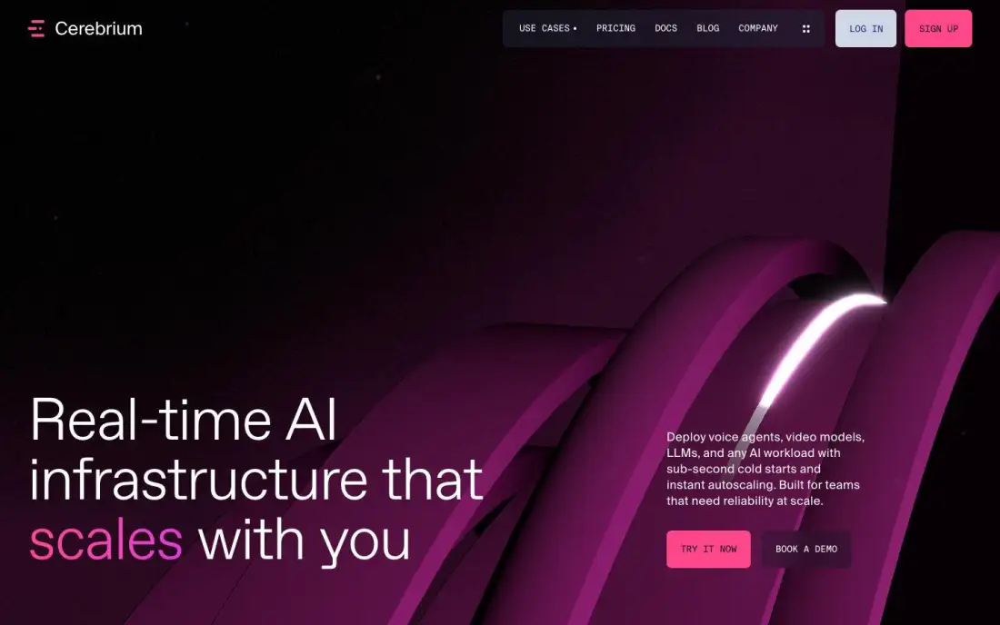
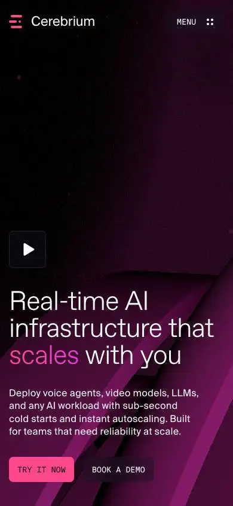

# Cerebrium — cerebrium.ai (Awwwards SOTD 2026-09-10)

> Tile note: the capture's tile numbering is non-linear for this site (home-t06 is a full-page thumbnail; t00 overlaps the end of t02). Tiles are cited by filename; section order below is taken from the full-page thumbnail (home-t06).

## 1. Snapshot
- **URL:** https://cerebrium.ai/ · **Captured:** 2026-09-23
- **Pages:** home, /use-cases/large-language-models, /pricing, /blog, /about, /book-demo, /contact (7)
- **Stack (detected):** Astro (static/prerendered), Lenis smooth scroll, one WebGL `<canvas>` on every page (three.js not fingerprinted, so it may be a custom or minified renderer), DatoCMS assets, no GSAP/Lottie/video. Fonts: ABC Favorit (display, a *Trial* build in production), Suisse Int'l (body), Suisse Int'l Mono (UI/labels).
- **Verdict:** This is the closest match to NoctusAI's brief. A dark WebGL ribbon hero sits behind real HTML H1 and CTAs on an Astro static build, and the site then shifts to calm, light, data-dense sections. The weak spots are H1 hygiene on subpages and a slow home load.

## 2. Positioning & messaging
- **5-second test:** passes. The H1 "Real-time AI infrastructure that scales with you" (home fold) plus the sub-line (voice agents, LLMs, sub-second cold starts) say what it is and who it's for. A developer knows the category immediately.
- **Device:** one word of the H1 ("scales") gets a pink→magenta gradient. The same emphasis device repeats on every H2 ("secure", "real-time AI", "Pay", "build AI"), so it works as the brand's typographic signature (home t00, t04; pricing fold; about fold).
- **Voice:** confident and technical, and it proves claims with numbers: "2–4s Cold Starts", "99.999% Uptime", benchmark bars reading 3.8s vs 156s (home t01). The copy is short and imperative: "Bring your own code. We'll run it."

## 3. Information architecture
- **Nav:** floating pill with USE CASES (dropdown: LLMs, Voice, Image & Video) · PRICING · DOCS · BLOG · COMPANY · a "more" dots menu, plus separate LOG IN (ghost) and SIGN UP (pink) buttons. Nav labels are set in mono uppercase.
- **Footer (home t05):** social icons; columns for Use Cases and Cerebrium (Pricing, Company, Docs, Blog, Contact, Status, Resources); a closing CTA block "Start serving LLMs in production today…" with GET STARTED / BOOK A DEMO.
- **Page types:** landing, use-case (vertical) landing, pricing, blog index (+ category filter tabs), about, demo form, contact form.
- **Sitemap sketch:** `/` → `/use-cases/{llm,voice,image-video}` · `/pricing` · `/blog` (+ `/blog/<post>`, filters: Case Studies/Tutorials/Announcements/Engineering) · `/about` · `/book-demo` · `/contact` · external: docs, status.

## 4. Home page anatomy
| # | Section | Purpose | Layout pattern | Visual device | CTA |
|---|---|---|---|---|---|
| 1 | Hero (fold) | Category + promise | Full-bleed dark canvas; H1 bottom-left, sub + CTAs bottom-right | WebGL glossy magenta ribbons with a travelling light streak, film grain, faint particles | TRY IT NOW (pink) · BOOK A DEMO (dark) |
| 2 | Logo strip (t06 thumb) | Social proof | Single row of customer logos on the dark hero bottom | Monochrome white logos | — |
| 3 | "Built for teams, pushing boundaries" (t06) | Transition to light theme | 2-col statement | Rounded light panel slides over the dark hero | — |
| 4 | WHY CEREBRIUM (t01, t02) | 4 differentiators | **Sticky left index** (4 pale headings, likely highlight on scroll) + right column of product-UI cards | Faux-UI widgets: benchmark bars, hex world map, terminal, line chart with tabs | — |
| 5 | SECURITY (t00, t03) | Compliance trust | Dark navy panel, H2 left, 4 icon+text items right | Line icons (shield, lock, cube, globe) | STATUS PAGE · SECURITY DOCS |
| 6 | Dot-grid interlude (t03) | Visual breath / transition | Full-width dot matrix with a few pink "active" cells | Probably animated (inferred) | — |
| 7 | Built with Cerebrium (t03) | Developer templates | Tabbed (Voice/LLMS/Other) 2-col card grid | Icon tiles | TRY NOW per card |
| 8 | Powering real-time AI across industries (t04) | Case studies | Horizontal carousel with arrow controls | Customer logo on a pale card + headline | Read Case Study |
| 9 | FEATURES (t04, t05) | Long-tail feature index | 2-col link list with arrows and hairline rules | Typographic only | per-row → docs |
| 10 | Latest from our blog (t05) | Freshness / SEO | 3-card grid | Thumbnails reuse the hero's 3D ribbon renders plus a white line icon | SEE ALL |
| 11 | Footer CTA (t05) | Close | Dark footer, CTA block right | — | GET STARTED · BOOK A DEMO |

## 5. Visual system
- **Typography:** H1 is ABC Favorit Trial **86px / 86px lh, weight 300, tracking −2.15px** (−2.5%). Subpage display sizes: 44px/50px, w300. Body is Suisse Int'l 16px. Mono is used for eyebrows ("• WHY CEREBRIUM"), nav and buttons (uppercase, ~13px). Light weight at large size carries the "premium infra" feel.
- **Color:** navy ink `rgb(23,43,118)` dominates light sections (×552); white; pale steel `#EEF2F5` / `#CFD7E7` for panels; near-black `#101421` for dark panels; single accent **hot pink `#FF488B`**, with a pink→magenta gradient on emphasised words. The hero palette is a deep aubergine/magenta 3D render. Two-accent discipline: pink for action, navy for everything else.
- **Light/dark:** there is no theme toggle, and prefers-color-scheme dark renders identically (home-darkpref-fold). The page itself alternates dark and light *sections* (dark hero → light features → dark security → light case studies → dark footer), with large-radius (~24px) panel corners where sections meet (t00, t04, t05). That is theme contrast used as a narrative device, not a user theme.
- **Grid/whitespace:** 12-col, with left column often empty or sticky (t01, t02) and right column carrying content, which leaves generous dead space on the left. Around 40px outer gutter.
- **Imagery / art direction:** one CGI motif (glossy ribbon + light streak) is reused on the hero, subpage heroes (LLM page shows a sphere, about shows vertical ribbons), blog thumbnails and the demo card backgrounds (t01, blog fold). That gives the brand one asset family, with a different camera angle per page.
- **Iconography:** thin-stroke line icons (security list, template tiles, blog thumbnails).
- **Radii/elevation:** buttons ~4px square-ish; cards ~12px; section panels ~24px; flat, no shadows; the pill nav is a translucent dark or white capsule.

## 6. Motion & interaction
- **Observed:** a WebGL canvas is present on all 7 pages (`webglCanvas:true`, canvasCount 1). The hero render differs per page (ribbons, sphere, vertical streaks), so it's one scene with per-route camera or props. Lenis is loaded for smooth scroll. On mobile (home-mobile-fold) a **play button** overlays the hero, which suggests the canvas pauses on mobile or is replaced by a user-started video. Tabs and a carousel are interactive (UI state visible).
- **Inferred:** the light streak travelling along the ribbon (a hot highlight in the fold) is probably an animated shader. The WHY CEREBRIUM left list is pale grey with no active item in the capture, which suggests a scroll-linked highlight on a sticky column. The dot grid's pink cells are probably animated.
- **Perceived weight:** home loadMs 16.1s, 126 requests (60 scripts), ~1.0MB counted. Subpages load in 1.0–5.5s. The home's long tail is probably the WebGL scene plus third-party scripts. Treat the byte figure as rough (headers missing).

## 7. Conversion design
- Dual CTA everywhere: **primary self-serve** (TRY IT NOW / SIGN UP / GET STARTED, pink) and **secondary sales** (BOOK A DEMO, dark). Sign-up is repeated in the nav at all times.
- Contextual CTAs sit inside sections (STATUS PAGE in security, TRY NOW on templates, START FOR FREE ×2 + CONTACT US in the pricing table).
- Forms: the demo form is minimal (first, last, email). Contact adds phone.

## 8. Trust & proof
- Logo strip under the hero; a case-study carousel with named customers and quantified outcomes ("50% Lower Inference Costs", "18x Faster Cold Starts"); a compliance block (SOC 2, HIPAA, GDPR, ISO); a public status page; benchmark comparison against "Provider A" and EKS/GKE; investors named on the about page.
- For NoctusAI: the *compliance + status + measurable benchmark* trio is proof that doesn't depend on customers, so it can be adapted now. Logos and case studies must wait.

## 9. Pricing (captured)
- The fold is split: a light left half ("Pay for what you use", with the gradient word "Pay") and a dark-canvas right half holding a white **compute-cost price sheet** (per-second GPU prices, with a Per Second / Per Hour toggle).
- Below: 3 plans (Hobby Free / Standard $100 / Enterprise Custom) and a **detailed comparison table** grouped as Workspace · Data & Compliance · Project Specifics · Support, with a CTA per column (p2-pricing-t01). This is followed by a cost calculator section ("Transparent Pricing"). JSON-LD includes **FAQPage**.
- The comparison table is marked up as dozens of H2s ("Seats", "Log retention", …), which is heading-outline abuse.

## 10. Content hub / blog (captured)
- `/blog` "Engineering Blog": a featured hero post (large card on the ribbon render) plus 4 stacked side posts; filter tabs; date + category in mono; thumbnails are ribbon renders or a flat slate tile with a white line icon. The system scales without bespoke art per post.
- Content mix: engineering deep dives, buyer's guide, compliance announcement, case studies. That mix is SEO fuel for a technical audience.

## 11. Technical & SEO
- **Meta:** keyword-rich titles in the pattern "Serverless GPU Infrastructure for Real-Time AI | Cerebrium"; per-page meta descriptions; one OG image reused site-wide (generic); twitter summary_large_image; canonical on every page; **no hreflang** (English only).
- **JSON-LD:** Organization + WebSite on all pages; SoftwareApplication on home and pricing; FAQPage on pricing; BreadcrumbList on use-case pages. This is a good schema model.
- **Heading hygiene:** the home has one H1, but it duplicates H3 labels (benchmark rows appear twice, desktop and mobile variants both in the DOM). On subpages the **H1 is a 16px eyebrow label** ("LARGE LANGUAGE MODELS", "COMPANY", "PRICING" in mono 13px) while the visual display headline is an H2. On about, an H2 even precedes the H1. That's an SEO/a11y anti-pattern.
- **Text in canvas:** none. All copy is HTML layered over the canvas, so the hero is SEO-safe.
- **Perf:** home 16.1s load / 126 req / 4,186 DOM nodes (heavy). Pricing 1.9s. About 1.0s. Home DOM is bloated by duplicate responsive markup.
- **Mobile:** H1 stays large (~44px) over the canvas, CTAs keep their side-by-side pair, nav collapses to MENU (home-mobile-fold).
- **Reduced motion:** not verifiable. The mobile play button hints at an opt-in motion pattern worth copying.

## 12. Steal / Adapt / Avoid for NoctusAI
- **[STEAL]** An HTML H1 + subhead + CTAs layered over a *decorative* WebGL canvas, with no text in the canvas. This is exactly the SEO-safe 3D-hero decision.
- **[STEAL]** One gradient-highlighted word per headline as the typographic signature. It's cheap, brand-defining, and theme-agnostic (works in pt-BR and EN).
- **[STEAL]** Reuse the hero's 3D asset family (static renders) for blog thumbnails and section cards. One art pipeline serves the blog, the OG images, and the WebGL poster frame.
- **[ADAPT]** Alternate dark and light *sections* with rounded panel seams. NoctusAI needs a real theme switch, so define both themes as tokens and keep a deliberate "always-dark hero panel" option.
- **[ADAPT]** Sticky-left-index + right faux-UI cards for "products showcase". Each NoctusAI vertical (ERP Imobiliário, Terapia, Finanças) gets a live-looking product widget instead of screenshots.
- **[ADAPT]** Swap the Security/compliance block for LGPD + data residency (BR) + status. It's proof that needs no customers, which fits the "no social proof yet" constraint.
- **[ADAPT]** Dual CTA pairing: primary = WhatsApp (prefilled) or sign-up (admin-toggleable), secondary = waitlist. Drop BOOK A DEMO.
- **[ADAPT]** Pricing split-screen + grouped comparison table + FAQPage JSON-LD. Use a real `<table>`, not H2-per-row.
- **[STEAL]** JSON-LD set: Organization, WebSite, SoftwareApplication (per product), FAQPage, BreadcrumbList.
- **[AVOID]** Eyebrow-as-H1 on subpages. The display headline must be the H1 (SEO-first).
- **[AVOID]** A 16s home load and ~4k DOM nodes. Lazy-mount the canvas after LCP with a static poster, and don't ship duplicate desktop/mobile DOM.
- **[AVOID]** A single generic OG image and a Trial font build in production. Generate per-page OG images (pt-BR + EN) and license fonts properly.
