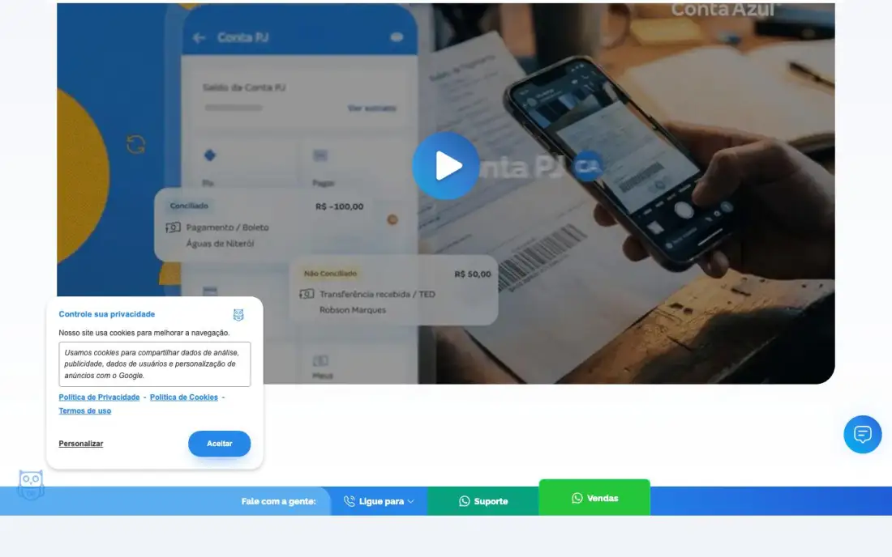
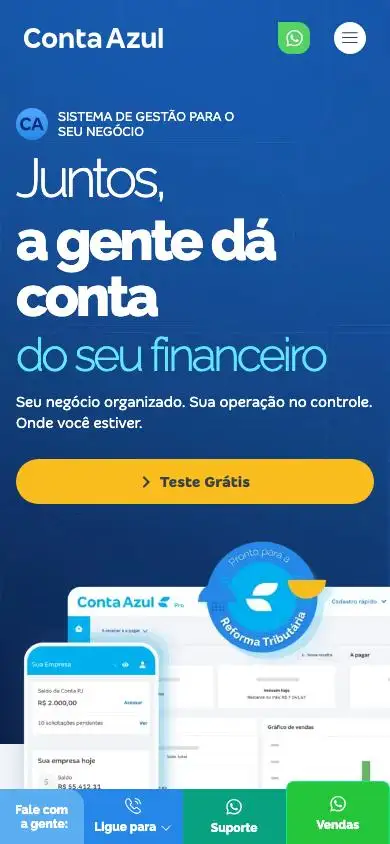

# Conta Azul: technical reference report

## 1. Snapshot
- **URL:** https://contaazul.com/ · **Capture date:** 2026-09-23
- **Pages captured:** home · `/planos/` (p1) · `/funcionalidades/emissao-de-nota-fiscal/` (p2) · `/para-negocios/clinica/` (p3, segment page) · `/cases-de-sucesso/` (p4) · `/blog/` (p5) · `/sobre/` (p6)
- **Stack:** Next.js with a Tailwind-v4-style token set on the main site (colors in `oklch()`, suggesting Tailwind v4 or shadcn tokens) and a WordPress media backend (`site-ca-prod…/wp-content`). **Two legacy surfaces are not Next.js:** the segment page (p3, Montserrat, older WP template) and the blog (p5, WP on a `blog.` origin, Bootstrap palette `#007BFF`). There are 1–3 video elements, and no WebGL/GSAP/Lottie.
- **Verdict:** This is the reference for **BR SMB conversion hygiene**: price on the home page, an annual/quarterly toggle, a trial CTA everywhere, and a permanent WhatsApp/phone bar. The brand voice is warm and colloquial. The site is split across three design generations.

## 2. Positioning & messaging
- **5-second test (darkpref fold, mobile fold):** Headline "Juntos, a gente dá conta da sua empresa", subhead "Seu negócio organizado. Sua operação no controle.", a yellow "Teste Grátis", and a large dashboard-plus-phone mockup with a "Pronto para a Reforma Tributária" seal. The category (financial management), the audience (small business owner) and the action are all clear.
- **The headline rotates its last line** ("da sua empresa" on desktop, "do seu financeiro" on mobile, "das suas cobranças" in the full screenshot). This is an animated word-swap, and the rotating phrase is the value prop.
- **H1 (DOM):** "SISTEMA DE GESTÃO PARA O SEU NEGÓCIO". It is the **16px eyebrow label**, while the big headline is an H2 ("Juntos, a gente dá conta das suas cobranças"). The keyword sits in a tiny H1 on purpose.
- **Voice:** colloquial pt-BR ("a gente", "Tá com dúvida? A gente explica.", "pra quem fatura"). Pun on the brand name ("negócio no azul", "a gente dá conta"). Reassuring and non-technical, with an owl mascot on the cookie banner.

## 3. Information architecture
- **Primary nav (darkpref fold):** Empresas ▾ · Soluções ▾ · Planos · Contador / BPO ▾ · Recursos ▾ · Reforma Tributária ▾ (a timely regulatory topic promoted to top-level nav). Then a **green WhatsApp icon button**, Entrar ▾ and **Teste Grátis** (yellow pill).
- **Audience split in the nav:** "Empresas" (business owners, by segment) vs "Contador / BPO" (accountants, a partner channel). This is a dual-audience IA.
- **Footer (home footer crop):**
  - 6 columns: Conta Azul (institucional + legal + cookie prefs) · Soluções (14 features) · **Empresas (13 segment pages: Advocacia, Clínica/Saúde, Engenharia, Terceiro Setor…)** · Contadores/BPO · Recursos (Educação: cases, blog, glossário, materiais, podcast, tutoriais; Tecnologia: Desenvolvedor, Integrações) · Reforma Tributária (Central, Calculadora, Diagnóstico).
  - Then app-store badges, a partner logo (Stone), certificates (AWS partner, GoDaddy "verificado e protegido") and **"Canais de atendimento" split by relationship** (Ainda não sou cliente / Já sou cliente / Conta PJ), each with WhatsApp and a 0800 number, plus Ouvidoria, "Atendimento por Libras", the BACEN correspondent-banking legal text and CNPJs.
- **Page types observed:** feature page (p2), pricing (p1), segment landing (p3), case index (p4), blog (p5), about (p6).
- **Sitemap sketch:** `/` → `/planos` · `/funcionalidades/{feature}` · `/para-negocios/{segmento}` · `/contador…` · `/reforma-tributaria/*` (calculadora, diagnóstico) · `/cases-de-sucesso/` · `blog.`→`/blog/` · `/sobre/`.

## 4. Home page anatomy
| # | Section | Purpose/job | Layout pattern | Visual device | CTA in section |
|---|---|---|---|---|---|
| 1 | Hero (darkpref fold) | Category, audience, trial | 50/50: text left, product mockup right on a deep-blue gradient | Rotating last line; desktop and phone UI mock; "Reforma Tributária" seal | "Teste Grátis" (yellow) |
| 2 | Persistent "Fale com a gente" bar (fold) | Human contact at all times | Full-width sticky bottom bar | Ligue para ▾ / Suporte (WhatsApp, teal) / **Vendas (WhatsApp, green, raised tab)** | 3 contact buttons |
| 3 | Product video (fold) | Show the product | Wide rounded video poster | Big play button over a Conta PJ UI collage | Play |
| 4 | Feature: Nota Fiscal (t01) | Pain → feature | Text left with pill label, UI illustration right | Pill label with icon, two-weight headline ("Diga adeus às **multas**") | "Evite multas fiscais" (link) |
| 5 | Feature: Conta PJ (t01) | Same pattern | Alternating | Reconciliation cards (R$ values) | "Abra a sua conta PJ" |
| 6 | Feature: Cobranças Automáticas (t01–t02) | Same pattern | Alternating | WhatsApp/SMS/email bubbles around a billing form | "Reduza a inadimplência" |
| 7 | "A gente dá conta de ponta a ponta" (t02) | Breadth of modules | Photo band with a blue rounded panel overlapping it | 11 outlined pill-links (module cloud) | Each pill links to a feature page |
| 8 | Stats + testimonial carousel (t02) | Proof | 3-column metric row, quote below | "+ de 85%", "+ de 1.900.000" notas/mês, "30h por mês" | "Assistir" (video testimonial), arrows |
| 9 | Pricing teaser (t00, t03) | Price transparency | Annual/Quarterly toggle, 3 cards | Strikethrough old price in red, "a partir de", savings line | "Comece Grátis" ×3 + "Confira todos os planos" |
| 10 | Reforma Tributária guide (t03) | Regulatory-anxiety lead magnet | Editorial collage: halftone portrait, blue/yellow shapes | Magazine-style type lockup | "Acesse o guia completo" |
| 11 | "Aprenda com a Conta Azul" (t04) | SEO content teaser | 3 blog cards | Category label, title, excerpt, "Ler mais" | "Confira o nosso Blog" |
| 12 | FAQ "Tá com dúvida?" (t04) | Objection handling and FAQ schema | Accordion, 5 items | Chevrons | n/a |
| 13 | Footer (footer crop) | Deep links, contact matrix, compliance | 6 columns plus contact block | Badges (AWS, GoDaddy, Stone), app stores | WhatsApp / 0800 |

## 5. Visual system
- **Typography:**
  - Main site: Raleway for display headlines (w300 thin plus w800 bold **within the same headline** for emphasis, e.g. "Seu **negócio no azul** começa aqui"; p4 and p6 H1 48/56, w300, tracking −1.44px) and "Ping Pong" (custom) for body and UI at 14px.
  - Legacy pages use Montserrat.
  - The weight-contrast headline is the signature typographic device.
- **Color:**
  - Background `oklch(0.966 0.007 260)`, a very light blue-grey (#F1F4F9-ish). Text near-black `oklch(0.145 0 0)`.
  - Brand blue about `#2687E9` / `oklch(0.62 0.17 253)`, deep navy hero gradient, **yellow `oklch(0.83 0.165 84)` for the primary CTA**, cyan-blue for pricing CTAs, WhatsApp greens in the contact bar, red strikethrough for old prices.
  - About 5 hues. Blue dominates.
- **Light/dark:** Darkpref shows no change and there is no toggle. The hero is dark-on-blue regardless of preference.
- **Grid/density:** Contained grid of about 1260px. Sections sit in huge rounded "sheets" (bottom-left/right radius about 80px, t02–t03) that stack like cards. Spacing is generous, and the long home page is about 10.4k px.
- **Imagery:** product UI illustrations (clean, redrawn, with real R$ values), blue-duotone photo bands, one editorial halftone portrait (t03).
- **Iconography:** rounded line icons inside pill labels; the owl mascot.
- **Radii/elevation:** very large radii (cards about 40px, asymmetric on pricing cards), soft blue shadows, pill buttons with a leading chevron "›".

## 6. Motion & interaction
- Rotating headline word (evidence: 3 different endings across captures). Hero and "about" have video (`videoCount` 1). The testimonial carousel has video "Assistir" links. There is no scroll-jacking or 3D. Motion weight is **light**, and the rotating phrase is the only "hero motion".
- The pricing toggle (Anual "MAIOR DESCONTO" / Trimestral) switches prices in place.

## 7. Conversion design
- **CTA types:**
  - "Teste Grátis" (header and hero, yellow).
  - "Comece Grátis" (pricing).
  - "Experimente por 3 dias grátis" (segment page p3; trial length differs by template).
  - WhatsApp **Vendas** and **Suporte** (sticky bar, header icon, footer).
  - "Ligue para" (0800 dropdown).
  - "Live chat: Fale conosco" (p3).
  - Content CTAs ("Acesse o guia completo").
- **Primary:** trial (yellow). **Secondary:** WhatsApp sales (green tab).
- **Sticky elements:** the header (with WhatsApp icon and Teste Grátis) **and** the bottom contact bar, **plus** a chat bubble bottom-right (fold). That is three simultaneous contact surfaces.
- **WhatsApp:** the most WhatsApp-forward site in the group. There are separate numbers or flows for prospects and for customers (footer).
- **Forms:** no lead form on home, because the trial flow is off-site. p3 has an email capture with a terms checkbox. The blog has an inline "Informe seu e-mail → Experimente Grátis" band (p5). No CNPJ was asked on the site itself (the product mockup shows a CNPJ lookup, t01).
- **Paths per audience:** Empresas by segment (13 verticals), Contador/BPO (partner channel with a separate case tab, p4), MEI vs ME vs pequena vs média, mapped **to plan tiers by annual revenue**.

## 8. Trust & proof
- Metrics: "+85% satisfeitas", "+1.900.000 notas/mês", "30h/mês de economia", "+100.000 empresas" (p1). Testimonial carousel with photo, name, company and a video link. The cases page (p4) has a featured case with a quote, filter tabs (Contadores e BPOs vs Pequenas e Médias Empresas), a 3-column card grid with pagination and case FAQs.
- About page (p6): founding timeline, executive team with photos, "trajetória em números", awards grid, events (Conta Azul Con), careers, a transparency/financial-statements block and a press logo strip (CartaCapital, Valor, Folha).
- BR-specific trust: BACEN-regulated correspondent-banking disclosure, CNPJs, Ouvidoria, "Atendimento por Libras", a "Pronto para a Reforma Tributária" seal, AWS and GoDaddy security badges, a Stone partnership, and the Visma group acquisition news (blog).

## 9. Pricing presentation (home t00/t03, p1 full)
- **4 plans on /planos** (Essencial MEI, Controle ME, Avançado pequeno porte, Performance médio porte). Home shows 3 (it drops MEI).
- **Anchor:** plans are equal-weight cards (no "most popular" badge seen). The anchor is the **strikethrough list price** ("de 549,90") against "a partir de 349,90/mês", plus "Você economiza R$ 200,00 por mês".
- **Toggle:** Anual (default, "MAIOR DESCONTO" badge) vs **Trimestral**, not monthly. The price shows no `R$` prefix on the big number ("349,90/mês"), while the savings line does.
- **Segmentation by revenue band:** "Pra quem fatura de R$81K até R$360K por ano" plus the user count ("Acesso de 2 usuários"). This maps directly to Simples Nacional / MEI thresholds, which is a strongly BR-native pattern.
- Enterprise path: none explicit. The FAQ covers accountant licensing, readjustment ("reajuste e reenquadramento") and cancellation.
- The feature page p2 has a **competitor comparison table** (Conta Azul vs "Concorrente 1/2/3", check marks).

## 10. Content hub / blog (p5)
- Separate WP blog with its own header (Assuntos ▾, Novidades da CA, Materiais Gratuitos, Parceiros, search, "Experimente Grátis").
- Layout: 3 stacked hero features (news, case, corporate), "Posts em destaque" (4 cards), "Últimos posts" (4×3 grid), "Ver todos os posts", an inline trial email-capture band, and a "Jornada do empreendedor" 4-stage path (Primeiros passos → Essencial → Controle → Gestão). **The content funnel mirrors the plan ladder.**
- Card anatomy: image, category chip, title, author avatar ("Equipe Conta Azul"), date.
- Taxonomy: 13+ topic categories (Contabilidade e Impostos, Gestão Financeira, E-commerce…). SEO content targets high-intent BR queries ("Modelo de DRE (+ planilha)", "O que é ERP?", "Melhores sistemas ERP do Brasil 2026", "Abrir MEI gratuitamente"), with free templates and calculators as magnets.

## 11. Technical & SEO
- **Titles:** keyword-led ("Emissor de Nota Fiscal Online: Teste Grátis | NF-e,NFS-e e NFC-e"). Meta descriptions carry proof and a CTA ("+1,9 milhão de notas emitidas por mês. Teste grátis, sem cartão.").
- **OG:** `og:image` is **null** on home, planos, cases and sobre. `twitter:card=summary` (small) on most pages. This is weak social preview hygiene.
- **Canonical:** self. **hreflang:** none (pt-BR only).
- **JSON-LD:** FAQPage on home, planos, feature and cases, plus a Yoast-style `@graph`. FAQ accordions are paired with FAQPage schema consistently.
- **Headings:** a keyword H1 as a tiny eyebrow (16px) with the visual headline as H2, which is deliberate keyword placement. Cookie modal headings ("Controle sua privacidade") leak into the outline.
- **Perf (rough):** home 3.3s, 142 requests. The bytes value (62MB) is inflated by streamed video and can be ignored. Planos about 1.1MB. The legacy segment page loads in 4.6s with 60 scripts. DOM stays lean (1–1.4k nodes).
- **Mobile (mobile fold):** full-width yellow CTA, WhatsApp icon next to the hamburger, and the sticky 4-cell contact bar persists. The mobile hero shows a different rotating word.
- **Consent:** a custom LGPD banner (owl) bottom-left with "Personalizar" / "Aceitar" (fold). The extract recorded "Rejeitar" and "Aceitar" CTAs, but the visible first layer only shows **Personalizar + Aceitar** with no equal-weight reject, which is a dark-pattern risk. There is a "Preferências de Cookies" footer link. The banner detector returned "none-found", but the screenshot shows it.

## 12. Steal / Adapt / Avoid for NoctusAI
- **[STEAL]** **A persistent WhatsApp contact affordance split by intent** (Vendas vs Suporte). For NoctusAI, use a header WhatsApp icon plus a floating button with a **prefilled message per context** (product page vs custom-build page). This is the BR-expected equivalent of "Contact sales".
- **[STEAL]** **Price on the home page with "a partir de" and a billing-period toggle** in a hideable pricing block. BR SMB owners expect a number, not "Fale com vendas".
- **[STEAL]** **FAQ accordion paired with FAQPage JSON-LD** on home, pricing and every product page. It is cheap SEO and fits the prerendered, SEO-first build.
- **[ADAPT]** **Tier segmentation by revenue band, business type or user count** (MEI/ME/…). NoctusAI can segment by audience (solo/freelancer, SMB, mid/enterprise, dev) instead of by feature matrix.
- **[ADAPT]** **Weight-contrast headlines** (thin plus heavy in one line) are a cheap, distinctive typographic device that survives light and dark themes. Pair them with the NoctusAI rebrand display face.
- **[ADAPT]** **Topical/regulatory lead magnet promoted to the nav** (Reforma Tributária). NoctusAI could run "IA + LGPD" or "IA para [vertical]" guides as SEO hubs.
- **[ADAPT]** **Footer "Canais de atendimento" matrix** (prospect vs customer). Useful once NoctusAI has multiple products with support channels.
- **[AVOID]** **Three stacked contact surfaces** (sticky bar, chat bubble, header icon) plus a cookie modal on first paint. The fold is cluttered and the CLS/INP cost works against Lighthouse ≥90. Pick one floating WhatsApp button.
- **[AVOID]** **Cookie banner without an equal-weight "Rejeitar"** on the first layer. NoctusAI's LGPD consent must offer accept and reject with equal prominence.
- **[AVOID]** **Three template generations** (Next, legacy WP segment page, WP blog with different fonts and header). NoctusAI's blog must share the site shell and tokens.
- **[AVOID]** **Null og:image and summary cards**, and a mismatched trial length across templates ("3 dias" vs FAQ). Generate OG per page at build time.
