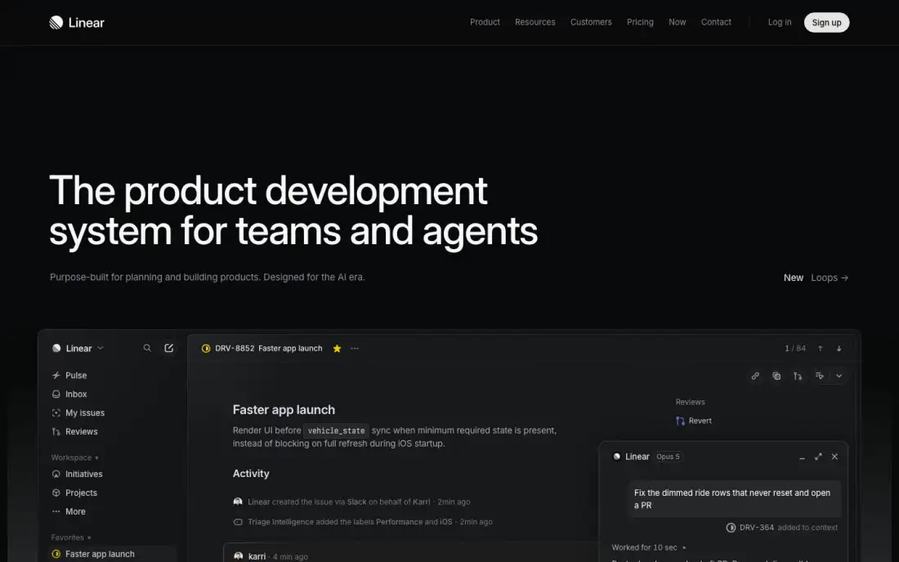
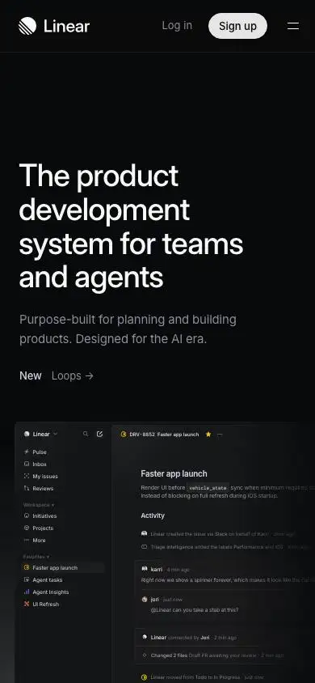

# Linear — technical reference report

## 1. Snapshot
- **URL:** https://linear.app/ · **Captured:** 2026-09-23
- **Pages captured:** home, /customers, /pricing, /now (blog/changelog hub), /contact
- **Stack:** Next.js (detected on every page). No three/WebGL/GSAP/Lenis/Lottie detected. `<video>` only on /customers (5) and /now (3). Fonts: Inter Variable + Berkeley Mono (home only).
- **Verdict:** The benchmark for a "product-UI-as-hero" dark site. Near-monochrome, typographic, extremely disciplined. Every visual is a fake-but-plausible product screen, not an illustration.

## 2. Positioning & messaging
- **5-second test (home fold):** "a product-development tool, built for teams working with AI agents" — clear from H1 plus the app-window mockup showing an issue with an "Opus 5" agent chat panel (home-fold).
- **H1:** "The product development system for teams and agents" (64px).
- **Subhead:** "Purpose-built for planning and building products. Designed for the AI era."
- **Right-aligned announcement chip** at subhead level: "New · Loops →" (home-fold). This replaces a banner bar.
- **Value-prop structure:** category claim (H1), then a 3-pillar manifesto ("A new species of product tool", with FIG 0.1–0.3: Purpose-built / Powered by agents / Designed for speed), then 4 workflow-stage chapters (Intake → Planning → AI & automations → Build/review/ship), each ending in a "Features" index of sub-feature links.
- **Voice:** declarative, confident, few adjectives, craft-centric ("A new species of product tool"). Technical but never jargon-heavy. Short sentences.

## 3. Information architecture
- **Primary nav (desktop):** Product ▾, Resources ▾, Customers, Pricing, Now, Contact | Log in, **Sign up** (pill). Product and Resources are dropdowns (extract nav list flattens to Customers/Pricing/Now/Contact/Docs).
- **Mobile:** logo + Log in + Sign up + hamburger (home-mobile-fold).
- **Footer:** 6 H3 columns — Product, Features, Company, Resources, Connect, Legal (home t05 thumbnail), preceded by the closing CTA band "Built for the future. Available today."
- **Page types seen:** marketing home, customer index (featured grid + filterable table), pricing (cards + long comparison matrix), content hub "Now" (blog + changelog + press merged), contact router.
- **Sitemap sketch:** `/` → `/customers` (tabs: Featured, SaaS, AI, Fintech, Consumer, Hardware, Health, Enterprise) · `/pricing` · `/now` (tabs: All, Changelog, Product launches, From the team, From the community, Press; search; RSS) · `/contact` (Sales / Support cards + community, email, docs) · `/docs` (external).

## 4. Home page anatomy
| # | Section | Job | Layout | Visual device | CTA |
|---|---|---|---|---|---|
| 1 | Hero | Category claim | Left-aligned H1, subhead left, "New: Loops" chip right; full-width app window below the fold line | Product-UI mockup (sidebar + issue + agent chat panel) | Sign up (header) only |
| 2 | Logo strip | Instant credibility | 7 logos in one row (OpenAI, Vercel, Salesforce, Figma, Cursor, Coinbase, Ramp) | Monochrome logos | — |
| 3 | Manifesto + 3 pillars | Why Linear | Big two-tone statement, then 3 columns labeled FIG 0.1/0.2/0.3 | Isometric line-art wireframes (home t01) | — |
| 4 | Intake & integrations | Feature chapter 1 | 2-col heading/body, then composite UI (Slack thread + kanban) | UI mockup | "Learn more →" + Features index |
| 5 | Planning & monitoring | Chapter 2 | Same template | Gantt timeline + "Cycle time by agent" chart (home t02) | Learn more + index |
| 6 | AI & automations | Chapter 3 | Same template | Horizontal row of agent chat windows (Cursor, Linear, ChatPRD) (home t03) | Learn more + index |
| 7 | Build, review, ship | Chapter 4 | Same template | Issue list + code diff viewer | Learn more + index |
| 8 | Changelog | Proof of momentum | 4-col timeline with dots, dated entries in mono | Text | View all → |
| 9 | Testimonials | Social proof | 2 big quote cards (pastel blue, lime yellow) + "40,000 product teams" line | Colored cards, only color on the page | Customer stories → |
| 10 | Closing CTA | Convert | Centered H2 "Built for the future. Available today." | Text | Get started (primary) + Contact sales |
| 11 | Footer | Navigation | 6 columns | — | — |

## 5. Visual system
- **Type:** Inter Variable everywhere; Berkeley Mono for dates, FIG labels, code, issue IDs. H1 64px/64px (line-height 1.0), weight 510, tracking −1.408px (≈ −0.022em). Subpage H1 48px/48px w510, −1.056px. Tight, geometric, medium-weight headlines, not bold. Section H2s are ~48px two-line stacks ("Intake / and integrations").
- **Color:** bg rgb(8,9,10) near-black, fg rgb(247,248,248). Greys 138/143/152 and 98/102/109 do the hierarchy. Accent is a single indigo rgb(94,106,210) used ~1–2× per page (toggles, send button). Status colors (yellow/red/green) only inside mockups. Effectively 1 hue plus greys; testimonial cards are the one deliberate color burst.
- **Light/dark:** dark-only. The darkpref fold is identical (home-darkpref-fold); no theme toggle.
- **Grid/density:** 1440 canvas, ~80px side gutters, strict 2-column (heading left / copy right at ~50%). Huge vertical rhythm (sections are 1,000–1,800px), separated by 1px hairlines.
- **Imagery:** no photography on home. UI mockups with vignette/fade-out edges; isometric line drawings. Customers page uses B/W photos + brand-color logo tiles.
- **Icons:** tiny monoline product icons inside the UI; "+" affordances in feature indices.
- **Borders/radii/elevation:** 1px low-alpha white borders (rgba 255,255,255,0.05–0.08), radii ~8–12px on windows, no shadows. Depth comes from gradient fades.

## 6. Motion & interaction
- No 3D, canvas or scroll libraries detected. Motion (if any) is CSS-level; the mockups render statically in captures. Perceived weight: very light.
- /customers and /now embed short videos (customer stories). The /now capture took 15.5s load (see §11).
- Interaction affordances: "Features +" expanders, tabbed filters on /customers and /now, search on /now.

## 7. Conversion design
- **CTA types:** Sign up (header pill, persistent), Log in, Open app, Get started (closing band), Contact sales (closing band plus Enterprise pricing), Download (desktop app, footer), "Learn more →" text links per chapter.
- **Primary vs secondary:** a single white pill = primary. Everything else is a grey text link. No CTA buttons inside the hero body. Conversion relies on the header plus the closing band.
- **Frequency:** header (sticky) plus 1 closing band per page, repeated identically on every subpage ("Built for the future. Available today." appears in every H2 list).
- **Forms:** none on-site (extract `forms: []` everywhere). /contact routes to Sales or Support cards and email/Slack.
- **Audience paths:** self-serve (Sign up) vs enterprise (Contact sales). No persona split in nav.

## 8. Trust & proof
- Logo strip directly under the hero; 2 named testimonials with photo-free logo attribution (OpenAI, Ramp); metric line "over 40,000 product teams".
- /customers: featured story cards (logo on brand color or B/W photo), a big "Powering more than 40,000 organizations" statement, logo row, then a long table (logo · name · one-line story · industry tags · Read story). Quantified outcomes in titles ("compressed bug resolution time by 52%").
- Security: only via the Enterprise plan bullets (SAML/SCIM, enterprise-grade security). No badges on home.

## 9. Pricing presentation
- **4 plans:** Free $0 · Basic US$10 · Business US$16 per user/month · Enterprise Custom (p3-pricing-fold).
- **Toggle:** per-card "Billed yearly" switch on the paid cards, not a global toggle.
- **Anchor:** no "popular" badge. Business has the longest list and a filled primary button (visible pill at the bottom edge of the fold).
- **Comparison table:** very long matrix grouped by category (Core, AI and agent workflows, Integrations, Team management, Analytics & Reporting, Linear Asks…) with check/cross plus quantity text ("15 pipelines", "5 levels") (p3-pricing t00/t01).
- **Enterprise path:** "Custom · Annual billing only" plus Contact sales.
- JSON-LD `WebPage` on /pricing only.

## 10. Content hub / blog ("Now")
- **Layout:** H1 "Now" plus category tabs, search and RSS icon (p4-now-fold); 3-column card grid separated by vertical hairlines; "Press" sub-section with 4-col video cards; "Changelog" and "Archive" sections; Load more.
- **Card anatomy:** 16:9 abstract generative thumbnail (line art, dot fields, dark UI) or B/W customer photo, then title (~20px), 2–3 line excerpt in grey, then "Author · Date" in small grey text.
- **Taxonomy:** All / Changelog / Product launches / From the team / From the community / Press.
- Dates plus authors are always shown. The hub merges blog, changelog and press into one stream.

## 11. Technical & SEO
- **Titles:** "Linear – The system for product development", "Pricing – Linear", "Now – Updates from the Linear team". Pattern: `Page – Brand`.
- **Meta descriptions:** present and specific on every page.
- **OG:** dynamic OG endpoint `/api/og/main?title=…` and `/api/og/generic?title=Pricing` (templated OG images). twitter:card = summary_large_image.
- **Canonical:** self-referencing on all pages. **hreflang:** none (EN only). **JSON-LD:** only `WebPage` on pricing; none on home (missed opportunity).
- **Headings:** single H1 per page. The home H1 text is duplicated in the DOM ("…agents The product…agents"), probably a responsive or animated duplicate. H3 "Faster app launch" leaks from the mockup into the outline.
- **Perf (rough):** home 2.3s, 726 requests (461 scripts, 182 stylesheets: heavy chunking), ~2.7MB. /customers 129MB is streamed video (ignore). /now 15.5s load.
- **DOM:** home 5,492 nodes (heavy because the mockups are real DOM, not images).
- **Mobile:** hero scales well (home-mobile-fold); mockups are cropped/scaled. The "Planning" chapter visual appears blank on mobile (home-mobile t01), i.e. hidden or not rendered at 390px.
- **A11y:** "Skip to content →" link present. Grey-on-near-black body copy (138,143,152 on 8,9,10 ≈ 6.4:1) passes AA. The darker grey 98,102,109 (≈3.6:1) is borderline for small text.

## 12. Steal / Adapt / Avoid for NoctusAI
- **[STEAL]** Product-UI mockup as hero visual, built in DOM/SVG, not screenshots: every NoctusAI vertical (ERP Imobiliário, Terapia, Finanças) can show a live-looking panel. It's SEO-safe (text stays text) and needs no social proof.
- **[STEAL]** One repeated chapter template (H2 left / copy right / mockup / "Features" index): maps 1:1 to an admin-toggleable "products showcase" section per product.
- **[STEAL]** Merged "Now"-style hub (blog + changelog + launches) with tabs, dates, authors and RSS. A changelog proves momentum while there are no testimonials.
- **[STEAL]** Templated dynamic OG images per page (`/api/og?title=`). Cheap SEO/social polish for pt-BR and EN pages.
- **[ADAPT]** Single-accent palette discipline (1 hue + greys). Keep it, but NoctusAI is theme-aware: define the accent so it holds contrast in both light and dark.
- **[ADAPT]** Closing CTA band repeated site-wide: swap "Get started / Contact sales" for "Falar no WhatsApp" (primary) + "Criar conta" / "Entrar na lista de espera" (admin-switchable).
- **[ADAPT]** Customers table (logo · story · industry · link): reuse the layout later for a "Produtos" index (product · one-liner · vertical · status: disponível / lista de espera). Do not use it for proof until real customers exist.
- **[AVOID]** Dark-only with no darkpref support: NoctusAI committed to light+dark with a toggle.
- **[AVOID]** 700+ requests / 461 script chunks: conflicts with the Lighthouse ≥90 target. Prerender plus a lean island architecture instead.
- **[AVOID]** Logo strip plus pastel testimonial cards as-is: NoctusAI has no proof yet, and placeholder logos would be fabrication. Keep the slot behind the "social proof" admin toggle, default off.
- **[AVOID]** Hiding feature visuals on mobile (blank Planning block on mobile): BR SMB traffic is mobile-first.
