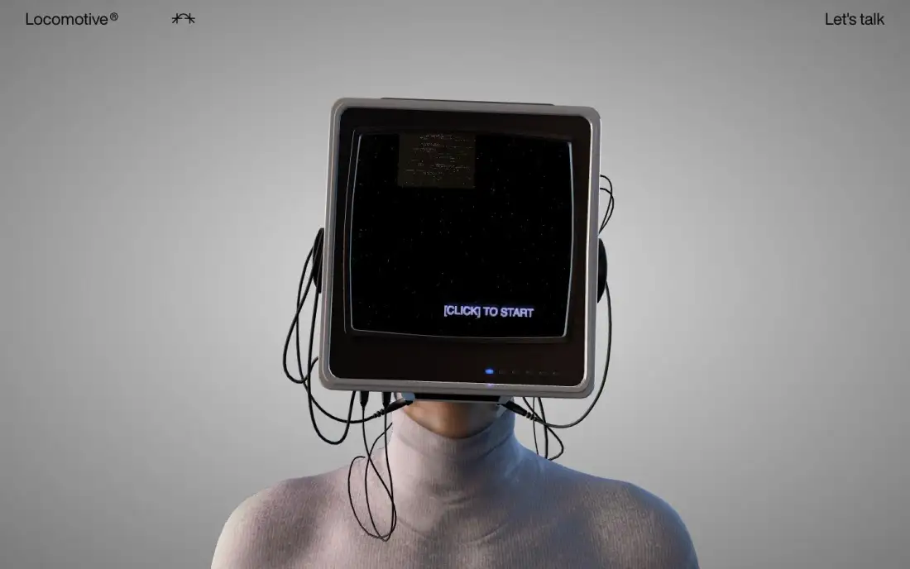
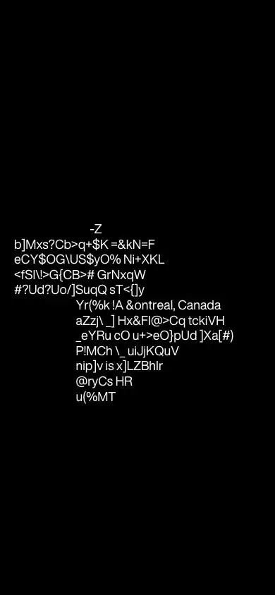

# L.I.S.A. by Locomotive — lisa.locomotive.ca (Awwwards SOTD 2026-09-16)

## 1. Snapshot
- **URL:** https://lisa.locomotive.ca/en · **Captured:** 2026-09-23
- **Pages attempted:** /en (home), /en/work, /en/agency, /en/contact, /fr. **Only /en and /fr exist.** /work, /agency and /contact return an in-app "Page Not Found" (H1) rendered over a 3D scene of walking volumetric people, so this subdomain is a single-experience microsite.
- **Stack (detected):** one WebGL canvas (engine not fingerprinted), no framework signature, no Lenis/GSAP; ~89 DOM nodes; 2 media files; 16–34 `fetch` requests per page (3D assets/textures). Fonts: HelveticaNowDisplay (UI), LocomotiveNew (display serif, seen on the 404).
- **Verdict:** A pure "experience" site. A realistic 3D character with a CRT-TV head shows "[CLICK] TO START" *inside the canvas* (home-fold). It has ~0 crawlable words, no H1, and a 10–20MB payload. As craft it's brilliant; as SEO architecture it's the anti-reference.

## 2. Positioning & messaging
- **5-second test:** fails for information, succeeds for intrigue. The visible text is the logo "Locomotive®", "Let's talk", and the in-canvas prompt. The meta description ("We are Locomotive®. An independent agency…") exists only for crawlers.
- The intro plays a **text-scramble preloader** that resolves to "Digital-First Design Agency… Based in Montreal, Canada" (home-darkpref-fold and home-mobile-fold were captured mid-scramble: glyph noise like "a)KHtal-First Design"). The message is delivered as animation, not as copy.
- **Voice:** playful and mysterious; the agency as an interactive persona ("L.I.S.A." = an AI/character conceit).

## 3. Information architecture
- **Nav (extract):** Locomotive® · Work · Agency · Careers · Store · Let's talk · Français. Visually only the logo, a glyph icon and "Let's talk" show on the fold. The rest is likely inside an overlay menu or the experience.
- **Page types:** experience home (en/fr) and a styled 404. Real content presumably lives on the main locomotive.ca domain (not captured).
- **Sitemap sketch:** `/en` ⇄ `/fr` (experience); everything else → 404.

## 4. Home page anatomy
| # | Section | Purpose | Layout pattern | Visual device | CTA |
|---|---|---|---|---|---|
| 0 | Preloader (darkpref/mobile fold) | Brand intro while assets load | Black full screen, centred scrambling text | Glyph-scramble typing effect | — |
| 1 | Experience stage (home-fold) | Hook | Full-viewport canvas; minimal HTML chrome in the corners | Photoreal 3D bust in a turtleneck with a retro CRT head, cables, starfield screen, an LED channel indicator (6 dots, i.e. "chapters") | "[CLICK] TO START" (in-canvas) · "Let's talk" (HTML) |
| — | (post-click) | Interactive narrative | Not capturable headless | Inferred: channels on the TV = scenes/case studies | — |

Page height is 900px (one viewport): there is no scroll content.

## 5. Visual system
- **Typography:** HTML UI uses HelveticaNowDisplay 15px body with ~24px nav text. The 404 H1 is LocomotiveNew **70px / 77px, w400**, a condensed high-contrast serif (p1-en-work-fold). In-canvas text is a pixel/CRT-glow bitmap style in lilac.
- **Color:** the HTML palette is literally black and white (×19/×9). The scene is a neutral grey studio gradient, a black CRT, and a lilac/blue screen glow. All colour lives in the render.
- **Light/dark:** none. The 404 is white; home is grey studio.
- **Grid:** corner-anchored chrome only (logo top-left, glyph, CTA top-right).
- **Imagery / art direction:** retro-tech meets human (CRT head on a real body); volumetric-video people walking on an isometric grid for the 404, which makes even the error page an experience.
- **Radii/elevation:** n/a.

## 6. Motion & interaction
- **Observed:** a WebGL scene on all routes; the preloader text scramble (captured mid-state); the channel-dot UI on the TV; the 404 scene with multiple animated characters (positions differ between captures p1 vs p3, so it's live).
- **Inferred:** a click starts a narrative (probably audio + channel switching); likely cursor-reactive head/camera; the character probably reacts to input.
- **Weight:** home 11.2MB, 15.9s load, 33 requests; 404 pages **15–20MB** each (the 3D crowd). This is the heaviest "per useful word" in the set by orders of magnitude.

## 7. Conversion design
- A single HTML CTA, "Let's talk" (→ contact on the main site presumably), always visible top-right. It works because the experience is a brand stunt, not a funnel.

## 8. Trust & proof
- None on-page. Trust is delegated to agency reputation and the Awwwards recognition. The meta description claims "global reputation".

## 9. Pricing
- n/a.

## 10. Content hub / blog
- n/a.

## 11. Technical & SEO
- **Meta:** the title is just "Locomotive" on every route; a good meta description (localised in FR); OG image set; **no canonical**, **no hreflang** despite en/fr twins (the FR page even localises the in-canvas prompt to "[CLIQUEZ] POUR COMMENCER", p4-fr-fold, yet doesn't declare the alternate); no JSON-LD.
- **Headings:** **no H1 on home** (h1: ""), 0 headings. Word count 2–3. The 404 pages return an H1 "Page Not Found", which may be a **soft 404** (status not captured). Ensure real 404 status codes.
- **Text in canvas:** the primary CTA and message are canvas-rendered. They're invisible to crawlers and screen readers and can't be selected or translated by the browser. Localisation needs asset or shader work per language.
- **Perf:** see §6. DOM is tiny (86–89 nodes), which is exactly why the SEO content is absent.
- **Mobile:** the mobile fold is a black preloader mid-scramble. The first contentful meaningful paint is delayed until assets load.
- **Reduced motion / a11y:** no evident non-WebGL fallback; keyboard access to "click to start" is unknown.

## 12. Steal / Adapt / Avoid for NoctusAI
- **[ADAPT]** An *opt-in* interaction gate ("clique para iniciar"). For NoctusAI's single interactive 3D hero, use a static poster + HTML H1 by default and let the user click "Explorar em 3D" to load the heavy scene. That protects LCP and Lighthouse ≥90.
- **[ADAPT]** A character/persona as brand device: an "AI assistant" 3D mascot could embody NoctusAI's visionary voice, but *beside* HTML copy, never instead of it.
- **[ADAPT]** Localising in-experience text per locale (they did en/fr inside the canvas). If NoctusAI shows labels in 3D, drive them from the same i18n strings as the HTML (pt-BR/EN), or better, overlay them as HTML.
- **[STEAL]** Make the 404 an on-brand micro-experience (lightweight version, e.g. a static or low-poly scene with a search box + popular links).
- **[STEAL]** The text-scramble reveal as a *micro*-effect on one eyebrow or keyword after HTML is painted, never as a blocking preloader.
- **[AVOID]** No H1, 3 words of HTML, and a title identical across routes. This is fatal for an SEO-first site.
- **[AVOID]** The CTA/message inside the canvas. All actionable text must be DOM (crawlable, accessible, translatable).
- **[AVOID]** 10–20MB payloads and a 16s load before interaction; asset-heavy 404s; en/fr twins without hreflang/canonical.
