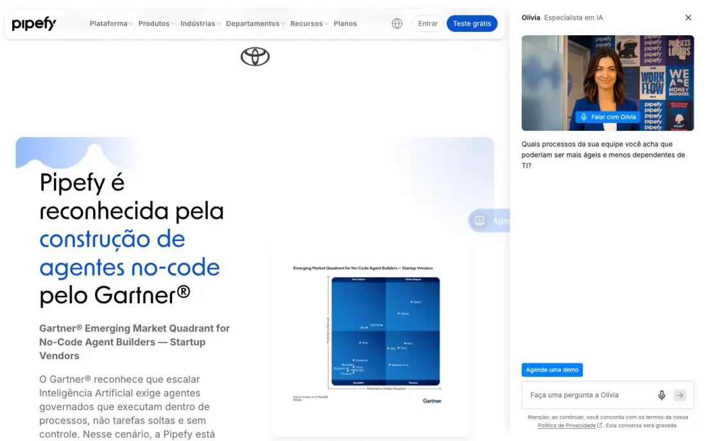
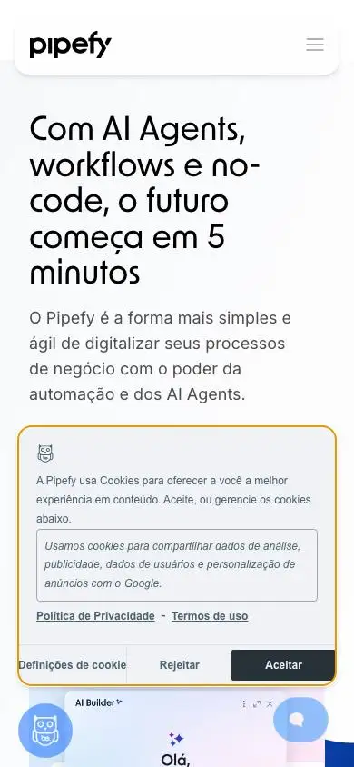

# Pipefy: technical reference report

> **Capture note:** Pipefy's below-the-fold content only appears when scrolled into view. The full-page desktop captures and tiles came out **blank white** (home t00/t01/t03/t06, p5 t00), and the mobile full page is mostly empty blocks. **All anatomy below is now observed** from the viewport-by-viewport scroll frames (1440×900, 800px/step) cited as "scroll home-sNN", "scroll produtos-sNN" and "scroll orquestracao-sNN". p2 (enterprise), p3 (AI) and p4 (Gartner) still rely on folds, partial renders and the extract. The blank full-page capture stays as a finding (§11). The cookie banner and the Olívia panel were never dismissed in the scroll frames, so they overlay every frame.

## 1. Snapshot
- **URL:** https://www.pipefy.com/pt-br/ · **Capture date:** 2026-09-23
- **Pages captured:** home · `/orquestracao-de-negocios-com-ia/` (p1) · `/eficiencia-em-escala-com-ia-enterprise/` (p2) · `/ai/` (p3) · `/pipefy-e-market-shapers-no-gartner-ncab-2026/` (p4, gated analyst-report page) · `/produtos/` (p5, product/template catalog). Scroll sequences: home s00–s17, produtos s00–s19, orquestração s00–s13.
- **Stack:** WordPress (`assets-site.staticpipefy.com/production/wp-content`) with a heavy script load (65–75 scripts, 25–80 stylesheets). No framework detected. 3–11 `<video>` elements per page. No WebGL, GSAP, Lenis or Lottie. The **"Olívia" AI video-avatar agent** runs as a persistent side panel with voice.
- **Verdict:** A Brazilian company positioned **global and enterprise, AI-agent first**. It sells no-code AI agents and orchestration ("BOAT") to IT. It is the closest peer to NoctusAI's "AI suite + custom" story, but tuned for enterprise demo-led sales. The site shows both the power and the cost of a heavy AI-native sales assistant.

## 2. Positioning & messaging
- **5-second test (scroll home-s00, darkpref fold):** a black promo bar (Gartner® recognition plus "Saiba mais"), then the H1 "Com AI Agents, workflows e no-code, o futuro começa em 5 minutos", then an AI Builder UI mock inside a large blue circle. The right ~28% of the viewport is the Olívia panel. The message comes through ("AI agents, no-code, fast"), but the fold is crowded by the panel and the cookie modal.
- **The hero rotates.** The first capture (home fold) showed a Gartner-quadrant slide in the hero slot, while scroll home-s00 shows the AI Agents slide. Analyst proof is a hero-level asset.
- **H1:** New Order 56/61.6 w500. Pillar pages use a light-weight display with a **violet→blue gradient phrase** ("…com **IA para a TI Enterprise**", scroll orquestracao-s00) under a pre-headline ("Descubra o **próximo capítulo** da orquestração de processos").
- **Value-prop structure:** speed ("em 5 minutos", "em dias, não meses", orquestracao-s05), governance and control for IT ("sem Shadow AI", orquestracao-s02), then quantified ROI (Forrester TEI, home-s14) and security certifications (home-s15).
- **Voice:** confident, visionary and enterprise-grade. Anglicisms are kept (AI Agents, AI Studio, BOAT, Time-to-Value). **Triad headlines** such as "Crédito aprovado. Risco reduzido. Conformidade garantida." (home-s04).

## 3. Information architecture
- **Primary nav:** Plataforma ▾ · Produtos ▾ · Indústrias ▾ · Departamentos ▾ · Recursos ▾ · Planos. Mega-menus (extract):
  - **Plataforma:** BOAT, Enterprise, Pipefy AI, Gartner.
  - **Produtos:** Casos de Uso, Agentes de IA, then 8 **"AI Studios"** (Background Check, CRM, SRM, Quotation, P2P, Onboarding, Decisão de Crédito, Claims).
  - **Indústrias:** 8 verticals.
  - **Departamentos:** 14.
- **Utility:** globe language switcher · "Entrar" (outline pill) · **"Teste grátis"** (solid blue pill). The header is a detached, rounded, shadowed "island" and stays sticky in every scroll frame.
- **Right-edge sticky tab "Agende uma demo"** (blue, with icon) appears from home-s03 onward and is **fixed on every subsequent frame** of all three pages. It is a second persistent demo CTA beside Olívia's own "Agende uma demo" chip.
- **Footer (scroll home-s16–s17):**
  - 6 columns: Empresa · Indústria (includes **"Mercado Imobiliário"**, Varejo, Energia, Serviços Públicos) · Departamentos · Produtos (Studios, Soluções de Negócio: BOAT, Enterprise, Pipefy AI, Analyst Relations) · Recursos (Blog, Histórias de sucesso, Templates, Guias e e-books, Glossário, Forrester TEI, Guia de BPM/BPA, Developers) · Ajuda (Central de ajuda, Academy, Community, Developer Hub, Segurança, Novidades, **Preços**, Portal Jurídico).
  - Then **"Peça a uma IA um resumo da Pipefy"** with a row of AI-assistant icons (ChatGPT, Perplexity, Claude, Gemini, Grok-style glyphs, home-s16).
  - A black bottom bar holds the logo, tagline, PT-BR switcher, socials, Privacy and Terms.
- **Page types:** platform pillar (p1/p2, near-duplicates), AI product line (p3), gated analyst page (p4), and the **catalog (p5)**: a left sidebar with template search plus Indústrias/Departamentos filters; purple-gradient **Studio** cards; then per-industry and per-department carousels of pale-lavender template cards (produtos-s00–s19).
- **Sitemap sketch:** `/pt-br/` → `/pt-br/{platform-pillar}/` · `/pt-br/ai/` · `/pt-br/produtos/` → studio/template pages · `/pt-br/{industria|departamento}/…` · `/pt-br/planos` · analyst/news landers. It is mirrored under `/en-us/`.

## 4. Home page anatomy (observed, scroll home-s00…s17)
| # | Section | Purpose/job | Layout pattern | Visual device | CTA in section |
|---|---|---|---|---|---|
| 1 | Promo bar (s00) | Push the Gartner recognition | Full-width black strip | White text, outline pill | "Saiba mais" |
| 2 | Hero, rotating (s00; fold) | Category and speed claim; alternate slide is analyst proof | Text left, visual right | AI Builder UI in a blue circle; alternate slide shows the Gartner quadrant | "Teste grátis" / "Agende uma demo" (hidden by the cookie modal) |
| 3 | "Escolhido por líderes de mercado" (s01) | Enterprise logo proof | Centered logo row, 2 lines | Greyscale Accenture, Coca-Cola, IBM, Nestlé, Nubank, Toyota | n/a |
| 4 | Gartner recognition (s01–s02) | Analyst validation | Text left, report card right, on a lavender gradient panel with cloud-bump top edge | Quadrant image in a white card | "Saiba mais" (blue→violet gradient pill) |
| 5 | "Uma plataforma de AI Agents completa e personalizável" (s02–s03) | 3 platform pillars | **Vertical accordion left** ("Em poucos segundos, transforme ideias em workflows" / "Gerencie tudo em um só lugar" / "Segurança de nível corporativo…"), synced visual right | AI Builder chat creating a "Solicitação de Reembolso" process, on a blue card | n/a |
| 6 | "Soluções especializadas… indústrias" (s04–s05) | Industry routing | Full-bleed blue rounded band; **industry list at left** (Serviços financeiros, Seguros, Bens de consumo…) switches a white card at right | Triad headline card plus a UI mock of the related workflow | "Saiba mais", "Veja todas as soluções →" |
| 7 | "A plataforma definitiva para orquestrar processos" (s05–s06) | Architecture explainer | Centered heading, **large layered architecture diagram** | Stacked layers: Pipefy Agent Studio (LLM row: GPT-5, AWS Bedrock, Azure OpenAI, Google Vertex, NVIDIA NIM, OCI) → AI Agents (RH, Financeiro, Suporte, Compras avatars) → Plataforma de Orquestração (Módulos, Workflows, Data & Analytics, Automação) → integration logos (SAP, Gmail, etc.) | n/a |
| 8 | "Descubra o AI Studio" (s06–s08) | AI product line | 2×2 feature grid, each with a UI screenshot in a soft card | "AI Agents prontos para usar", "AI Assistants integrados", "Governança corporativa flexível", "Visibilidade completa de uso" (admin/credits dashboard) | n/a |
| 9 | "Explore a plataforma de Orquestração" (s09–s10) | Platform capabilities | 2×2 grid in a grey panel | Automação e integração; **Mensageria corporativa** (Gmail, Teams, Slack, **WhatsApp** icons); Portais; Orquestração end-to-end, each with a UI mock | n/a |
| 10 | "Indiscutivelmente reconhecida…" (s11–s12) | Awards | Centered heading, badge row | Round and medal award badges (Future of Work 2024, The Software Report, DNA, etc.) | "Ver premiações" |
| 11 | "A escolha dos líderes: IA e no-code para resultados imediatos" (s12–s13) | Testimonials | Lavender panel with a horizontal testimonial carousel (5 dots) | Quote, company logo tile (Accenture, Samsonite, Bloom Brands), name and title | n/a |
| 12 | "Resultados comprovados" (s13–s14) | Quantified ROI | Navy rounded band: report mockup left, 2×2 stat grid right | **Forrester TEI**: 260% ROI, 40% tempo economizado, 50% redução no desenvolvimento, <6 meses de retorno | "Acesse o relatório completo →" |
| 13 | Security (s14–s15) | Risk removal | Navy band | AICPA SOC / SOC 2, GDPR and ISO 27001 badges | "Saiba mais em Pipefy Security →" |
| 14 | Closing CTA (s15) | Final conversion | Split: giant light-weight headline "Inteligência artificial se tornando realidade nas suas tarefas diárias" left, copy right | Oversized display type | "Agende uma demo" (solid) + "Teste grátis" (outline) |
| 15 | Footer (s16–s17) | Deep links, GEO hook | 6-column link grid plus black bar | "Peça a uma IA um resumo da Pipefy" with AI-assistant icons | n/a |
| n/a | Persistent overlays (all frames) | Sales capture | Right-edge "Agende uma demo" tab plus Olívia side panel | Olívia's proactive message **changes with scroll depth** (s00 generic, s01+ about manual work, s08+ "…sem depender totalmente do TI?") | "Falar com Olívia", "Agende uma demo" |

**Orquestração pillar (scroll orquestracao-s00…s13), observed sequence:**
1. Breadcrumb plus gradient hero ("Descubra o próximo capítulo…") (s00).
2. The same logo row (s01).
3. "Agilidade na implementação com governança…" with a **tabbed module switcher** (Orquestração / Automação / Design Low-Code / Conectividade / IDP / TI Enterprise) over a violet gradient card with a UI mock (s02).
4. The Forrester TEI band, **with different numbers: 220% ROI, 34%, 42%, <5 meses** (s03).
5. Security: "Certificações de Segurança & Compliance" (SOC1, SOC2, ISO 42001 and 27001), an accordion, and badges including **LGPD** (s04–s05).
6. "Resultados com IA, em dias, não meses, em qualquer indústria" as a dark industry carousel (s05–s06).
7. "Comece rápido… casos de uso agênticos" as a pill-chip cloud of Studios and use cases (s06).
8. "Histórias de sucesso" metric cards (Henry Schein, Roca "200 horas economizadas", Fujifilm "30% menos lead time") (s07).
9. **"Peer insights"** with 3-star-rated reviews showing reviewer role, company size and sector (s08).
10. **"Entendendo a Era do BOAT"**, an FAQ accordion with 7+ questions (s08–s10).
11. The testimonial carousel (s10–s11).
12. The closing CTA (s12).
13. Footer (s13).

## 5. Visual system
- **Typography:** "New Order" display, mostly **light-to-regular weight at large sizes** (closing headline and pillar H2s are thin and oversized, home-s15). Inter 16px body. Emphasis comes from **color within headlines** (a blue phrase, or a violet→blue gradient on pillar pages).
- **Color:** white and `#F2F2F2` neutrals, text `#333`/`#676767`, primary blue `#0952CC`, navy bands (ROI, security), full-bleed **royal-blue** band (industries, home-s04), pale lavender panels (testimonials, template cards), and violet→blue gradients for AI surfaces (Studio cards produtos-s00, "Saiba mais" pill, pillar hero). About 3 hue families.
- **Light/dark:** darkpref shows no change. No toggle is visible in any frame, so p5's `themeToggle:true` is a false positive.
- **Grid/density:** content column about 1000px because Olívia takes about 400px of 1440. Pages are long (home 13.9k, produtos 15.7k px). Sections are **large rounded panels** (about 32px radius) floating on white, some with a "cloud bump" top edge (home-s01).
- **Imagery:** product UI mocks everywhere (builders, admin consoles, dashboards), a detailed architecture diagram (home-s06), analyst and report covers, corporate portraits only in Olívia and p3.
- **Iconography/badges:** certification roundels (SOC, ISO, GDPR, LGPD), award medals, AI-assistant logo icons in the footer.
- **Radii/elevation:** pills everywhere, large-radius panels, soft card shadows, sticky floating header.

## 6. Motion & interaction
- Rotating hero. **Scroll-triggered reveals** (the reason the full-page captures are blank). Accordion with a synced visual (home-s03). Industry list switcher (s04). Tabbed module switcher (orquestracao-s02). Testimonial and industry carousels with dots (s13, orquestracao-s06). Template carousels per category (produtos). FAQ accordion (orquestracao-s08).
- **Olívia**: a live video avatar with voice ("Falar com Olívia"), a text input with mic, and **scroll-contextual proactive prompts**, plus a recording disclaimer. It is auto-open on every page.
- **Perceived weight:** heavy. Home loads in 12.0s, p1 in 16.4s, 250–285 requests.

## 7. Conversion design
- **CTA types:** "Teste grátis" (sticky header primary), "Agende uma demo" (**sticky right-edge tab**, Olívia chip, closing), "Usar agora" (self-serve template install, produtos) vs "Agendar uma demo" (per template, produtos-s01+), "Visualizar", "Saiba mais", "Acesse o relatório completo", "Ver premiações", gated "Acesse seu conteúdo" (p4).
- **Primary vs secondary:** the header favors trial, while the body and persistent overlays favor demo. In the closing CTA, demo is solid and trial is outline (home-s15). **Per template the CTA switches** between "Usar agora" (self-serve) and "Agendar uma demo" (complex use cases), which is a fine-grained routing pattern (produtos-s01, s06).
- **Persistent surfaces:** a sticky header, a right-edge demo tab, the Olívia panel and the cookie modal (never dismissed in the frames). That is four simultaneous overlays.
- **WhatsApp:** only as an integration icon in "Mensageria corporativa" (home-s09). There is no WhatsApp contact CTA anywhere, which is an outlier for a BR company.
- **Forms (p4 full):** Primeiro nome, Sobrenome, E-mail corporativo, Número de telefone, Nome da empresa, consent note. No CNPJ or cargo.
- **Paths per audience:** Industries × Departments × Studios, the catalog with search, Enterprise IT pillar pages, and the self-serve trial and templates for teams.

## 8. Trust & proof
- Enterprise logos (home-s01; p3 fold adds Capgemini, Zeiss, Lacoste, GE HealthCare, Kraft Heinz). Gartner® NCAB 2026 (promo bar, hero slide, H2 section, gated page). An awards row (home-s11).
- **Testimonials** with logo, name and title (home-s12–s13), **Peer-insights star reviews** with reviewer metadata (orquestracao-s08), and metric case cards (orquestracao-s07).
- **Forrester TEI stats** are the main quantified proof, but **the figures differ by page**: home shows 260% / 40% / 50% / <6 meses (home-s14), while orquestração shows 220% / 34% / 42% / <5 meses (orquestracao-s03), under the same "Total Economic Impact™" framing. That is a proof-consistency defect.
- Certifications: SOC1/SOC2, ISO 27001/42001, GDPR, **LGPD badge** (orquestracao-s04–s05). There are no Reclame Aqui-type BR consumer seals, consistent with a global enterprise target.

## 9. Pricing presentation
- "Planos" is in the primary nav and "Preços" in the footer (home-s16), but no pricing page was captured and no prices appear on captured pages. Enterprise conversion goes to demo.

## 10. Content hub / blog
- Not captured directly. The footer shows the breadth: Blog, Histórias de sucesso, Templates, Guias e e-books, Glossário, Forrester TEI report, Treinamentos ao vivo, Guia de BPM/BPA, Guia de melhorias de processos, Developer Hub (home-s16).
- **Product-led content:** the /produtos catalog is effectively a template gallery (produtos-s00–s19). Each card has a category chip, a title, a one-line AI-agent benefit and "Usar agora" / "Visualizar", grouped per industry and department. It is SEO surface and activation in one.
- **Pillar-page FAQ** ("Entendendo a Era do BOAT", orquestracao-s08–s10) is category-education content, but there is **no FAQPage schema** in the extract.

## 11. Technical & SEO
- **Titles:** "Pipefy: Agentes de IA para Automação de Processos", "Produtos | Pipefy". Meta descriptions end in a CTA.
- **OG:** per-page images, `summary_large_image`. Some og:title values differ from `<title>` (p1).
- **Canonical:** self. **hreflang:** `en-us`, `pt-br`, `x-default` on every page. This is the best i18n hygiene in the group, with a language switcher in the header and footer (home-s17).
- **JSON-LD:** Yoast `@graph` only. No FAQPage despite visible FAQ accordions.
- **Headings:** p5 has H2s ("Indústrias", "Departamentos") before its H1. p1/p2 pillar pages are near-duplicates (same H3 sets), which risks cannibalization.
- **GEO hook:** "Peça a uma IA um resumo da Pipefy" (home-s16) links to AI assistants, an explicit **generative-engine-optimization** play.
- **Perf (rough):** home 12.0s, 257 requests, about 18.7MB. p1 16.4s, 284 requests. The worst in the group.
- **Scroll-gated rendering (fragility finding, kept):** a non-scrolling full-page capture renders **blank** (home t00–t06, p5 t00), and content only appears under real wheel-scroll (scroll frames). Text exists in the DOM (the heading extract worked), so indexing likely survives. But any crawler, link-preview or AI-summary renderer that takes a static snapshot without scrolling sees empty sections. Visible content must never depend on IntersectionObserver.
- **Mobile (mobile fold):** clean hero type, but the cookie modal covers about 40% of the viewport with an owl consent icon and a chat bubble over it.
- **Consent:** a custom banner bottom-left with **three equal-weight buttons: "Definições de cookie" · "Rejeitar" · "Aceitar"**. It is a good LGPD pattern, but the modal **floats over content on every scroll frame** until acted on. Olívia carries a recording disclaimer.

## 12. Steal / Adapt / Avoid for NoctusAI
- **[STEAL]** **hreflang pt-br/en-us with x-default, plus a globe language switcher** in the header and footer. It matches the pt-BR primary with EN toggle.
- **[STEAL]** **Equal-weight "Rejeitar / Aceitar / Definições" consent.** Use it before GA4 and Meta Pixel fire. Make it a bottom bar, not a floating modal over content.
- **[STEAL]** **"Peça a uma IA um resumo" footer hook** (home-s16). It costs almost nothing and is on-brand for an AI company. It fits NoctusAI's SEO-first stance (pair it with `llms.txt` and clean prerendered copy).
- **[STEAL]** **Per-item CTA routing in the catalog** ("Usar agora" for self-serve, "Agendar demo" for complex; produtos-s01). For NoctusAI product cards, use "Criar conta" (if admin-enabled) or "Entrar na lista de espera" for ready products, and "Falar no WhatsApp" for custom builds.
- **[ADAPT]** **Layered architecture diagram** (home-s06: LLM providers → agents → orchestration → integrations). This is the ideal "technical" credibility device for NoctusAI's custom-builds section, with honest capability proof and no social proof needed. Render it as SVG so it themes in light and dark.
- **[ADAPT]** **Accordion with a synced visual** (home-s03) and an **industry list with a detail card** (home-s04). They are compact ways to show multiple vertical products without a long page. Each works as one admin-toggleable section.
- **[ADAPT]** **Scroll-contextual assistant prompts** (Olívia changes its opener by section). NoctusAI's assistant, if any, should be opt-in, lazy-loaded after consent and interaction, and hand off to prefilled WhatsApp.
- **[ADAPT]** **Triad headline rhythm** and **color or gradient phrases inside light-weight display headlines**. Both fit the confident/technical and visionary voice and survive theme switching.
- **[AVOID]** **Four simultaneous overlays** (sticky header, right-edge demo tab, auto-open avatar panel, floating cookie modal). They take about 30% of the desktop viewport on every frame. The NoctusAI fold should show one message, the 3D visual and one primary CTA, with at most one floating WhatsApp button.
- **[AVOID]** **Content revealed only on scroll with no static fallback.** NoctusAI's prerendered HTML must be fully visible without JavaScript and IntersectionObserver. Motion is progressive enhancement only, honoring `prefers-reduced-motion`.
- **[AVOID]** **Inconsistent proof numbers across pages** (Forrester 260% vs 220%). NoctusAI must source every number from one canonical data file, and publish none until they are real.
- **[AVOID]** **12–16s loads and about 70 scripts.** They directly contradict Lighthouse ≥90.
