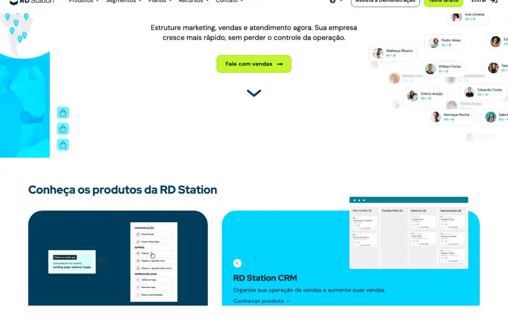
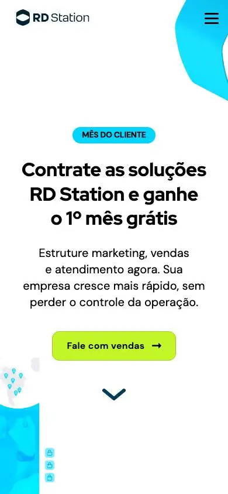

# RD Station: technical reference report

## 1. Snapshot
- **URL:** https://www.rdstation.com/ · **Capture date:** 2026-09-23
- **Pages captured:** home · `/demonstracao/marketing/` (p1) · `/produtos/marketing/` (p2) · `/ferramentas/analise-geo/` (p3, standalone lead-magnet tool) · `/jornadas/marketing-vendas/` (p4) · `/integracoes/rd-station-crm/` (p5)
- **Stack:** Next.js on every page (extract `nextjs:true`). The CMS is headless WordPress (OG images come from `api.rdstation.com/wp-content`). No three/WebGL/GSAP/Lenis/Lottie. One `<video>` on home. About 86 stylesheet requests per page, likely CSS-module chunking.
- **Verdict:** This is the most mature BR SaaS "multi-product suite" site in the set. It is built around three products, and every section ends in a trial, demo or sales CTA. It is a good model for the NoctusAI suite IA, though its visual layer is conventional and light-only.

## 2. Positioning & messaging
- **5-second test (home fold, darkpref fold):** A promo pill "MÊS DO CLIENTE", then the headline "Contrate as soluções RD Station e ganhe o 1º mês grátis", a subhead about structuring marketing, sales and service, and one lime CTA "Fale com vendas". The page reads as a **promotion**, not a positioning statement. You learn the offer before you learn what the product does.
- **H1 (DOM):** "Conheça os produtos da RD Station" (Red Hat Display 32/38.4, w700). The large visual hero headline is **not** the H1. The H1 is the product-grid heading below the fold.
- **Value-prop structure:** a suite umbrella ("marketing, vendas e atendimento"), then 3 products with one-line jobs ("Organize sua operação de vendas…"), then pain-based routing ("Qual seu principal desafio hoje?"), then AI as a cross-cutting layer ("Feito com Lynn").
- **Voice:** direct, second person, outcome verbs ("Atraia", "Converta", "Venda mais"), light informality. The pricing header "sem letra miúda" (p2 t01) is a trust-by-candor line. The title tag carries "nº 1 🇧🇷", so national-leader framing reaches all the way into the SERP.

## 3. Information architecture
- **Primary nav (fold):** Produtos · Segmentos · Planos · Recursos · Contato, all mega-menus. The Produtos mega-menu (extract nav) lists each product with a feature sub-list, a one-line benefit per item and a per-product CTA pair ("Veja todos os recursos" / "Comece o teste grátis agora" / "Crie uma conta gratuita agora"). A "Soluções Integradas" column covers journeys, a free diagnosis and AI.
- **Utility nav:** globe (region) dropdown · "Assista à Demonstração" (outline) · "Teste Grátis" (lime, primary) · "Entrar" with icon. On integration pages the outline button changes to "Publicar um app" (p5 fold), so the header CTA is **context-aware per section**.
- **Footer (home t03):** 5 columns: RD Station Marketing / CRM / Conversas (each with Conheça, Preços, Histórias, Suporte, Demo, then a FUNCIONALIDADES sublist) · Aprenda (RD Summit, Universidade, Blog, Materiais Gratuitos, Agências, Glossário) + Parceiros · Institucional (includes "Informação Legal e Privacidade", "Inteligência Artificial", two sitemaps). The bottom row has the "Uma operação TOTVS" parent-company badge, social icons, phone with business hours, full street address, and the CNPJ in the copyright line.
- **Page types observed:** product page (p2, long-form with pricing), demo library (p1, video-card grid with filter chips and pagination), free-tool lead magnet (p3, stripped nav), solution/journey page (p4), integration marketplace detail (p5, with breadcrumb and related cards).
- **Sitemap sketch:** `/` → `/produtos/{marketing,crm,conversas}/` → `/planos` · `/segmentos/*` · `/jornadas/*` · `/demonstracao/{produto}/` · `/integracoes/{slug}/` · `/ferramentas/{tool}/` · blog, glossário and universidade in Recursos/Aprenda.

## 4. Home page anatomy
| # | Section | Purpose/job | Layout pattern | Visual device | CTA in section |
|---|---|---|---|---|---|
| 1 | Hero promo (fold) | Seasonal offer and suite one-liner | Centered text, decorative art on both sides | Cyan ribbon swoosh top-right, Brazil map with pins at left, floating "agent" chips with avatars at right | "Fale com vendas" (lime) + scroll chevron |
| 2 | "Conheça os produtos" (fold, t04) | Route to the 3+1 products | Bento: large navy card, cyan card, 2 small cards | UI screenshots inside colored rounded cards (kanban, automation flow) | "Conhecer produto ›" per card |
| 3 | "Comece mais fácil com um tour" (t01) | Self-serve product education | Intro text at left, 3 video cards | Presenter thumbnails with a "DEMONSTRAÇÕES" overlay and product tag chips | "Assistir demonstração ›" |
| 4 | Radar GEO "NOVO" (t01) | Free AI-visibility tool as lead magnet | 50/50 image and text | Photo with gradient halo and sparkle stars | "Faça a análise gratuita ›" |
| 5 | "Qual seu principal desafio hoje?" (t01) | Pain-based router | Full-bleed pale-cyan band, white card, single input | Search-style input with a lime button | "Ver solução" |
| 6 | "Entenda o perfil de cada produto" (t00) | Product comparison and qualification | 3 equal outlined cards, border tint per product | Check-list bullets, "E muito mais" | "Conhecer planos →" (outline) |
| 7 | "Feito com Lynn" AI band (t02) | AI as a cross-suite layer | Full-width cyan rounded panel | Bullet list, placeholder UI mock | "Veja o que tem de IA em cada produto ›" |
| 8 | Testimonials (t02) | Social proof | 3 pastel cards (mint, lavender, peach) | Big quote marks, name and role | "Veja mais cases →" (navy, filled) |
| 9 | Integrations (t02–t03) | Ecosystem breadth | Grey rounded panel with a scattered logo cloud | Circular white logo chips (Facebook, Shopify, Gmail, Notion, Zendesk…) | "Conheça nossas integrações ›" |
| 10 | "Conheça mais a RD Station" (t03) | Content hub teaser | Horizontal carousel with arrows | Tall image cards (Blog, Agências, Panoramas 2026, Glossário, Universidade) with "+" | Card click |
| 11 | Hidden contact form (extract) | Sales lead capture (modal) | Modal | n/a | "Solicitar contato" |
| 12 | Footer (t03) | Deep links and legal | 5-column link grid | TOTVS badge, CNPJ | n/a |

## 5. Visual system
- **Typography:** Red Hat Display for headings (H1 32–48px, lh 1.2, w700, normal tracking; p3 48/57.6) and DM Sans 16px for body. Both are self-hosted via `next/font`, per the `__redHatDisplay_*` hashes. Uppercase eyebrow labels ("AVALIAÇÕES DE NOSSOS CLIENTES", "NOVO") in small bold caps.
- **Color:** White background. Near-black text `#000` / `#212429`. Brand navy `#005A87` / `#003D5C` / `#002233`. Cyan `#7BEFFF`. **Lime `#C3F628` reserved for primary CTAs**. Pastel lavender `#F0E3FF` and mint/peach on testimonial cards. There are about 6 hues in active use, but lime is the only "action" color, which gives a strong conversion signal.
- **Light/dark:** Darkpref fold is identical to light. The site ignores `prefers-color-scheme` and has no toggle.
- **Grid/density:** Contained grid of about 1280px with 80px gutters. Generous vertical rhythm (about 120–160px between sections). The product page is very dense (p2 is 14k px long, with an 18-card feature grid filtered by funnel stage, p2 t00).
- **Imagery:** Real product UI screenshots in rounded frames, bright stock photos of people at laptops, flat decorative shapes (ribbon, map). No 3D.
- **Iconography:** Small line/solid icons in navy. Tag chips such as "TODOS OS PLANOS", "PRO" and "ADVANCED" on feature cards (p2 t00).
- **Borders/radii/elevation:** Large radii (about 24–32px) on panels and cards, 1px tinted borders, almost no shadows. Buttons are pill-ish (about 8px radius) with a trailing arrow.

## 6. Motion & interaction
- No canvas, WebGL or animation libraries were detected. There is one video element on home (likely the hero art or a demo). The hero chips (avatars with "12h" badges) look designed for a subtle float/marquee, but this is static in capture.
- Interaction patterns: mega-menus, carousels ("Conheça mais"), funnel-stage filter chips (p2), demo filter chips and pagination (p1), and a pain-search input with autocomplete (t01).
- **Perceived weight:** light motion and heavy content. The page earns engagement through tools and routing, not spectacle.

## 7. Conversion design
- **CTA types:** Teste Grátis (primary, lime, in the sticky header) · Fale com vendas · Assista à Demonstração (live and recorded) · Compre agora (self-serve checkout on the Light/Basic plans) · Solicitar contato (modal form) · Conhecer planos · free-tool CTA ("Analisar marca grátis") · Ver solução (pain router).
- **Primary vs secondary:** lime filled means primary, a navy outline means secondary, and a text link with a chevron is tertiary. Very consistent across pages.
- **Frequency:** home has about 16 distinct CTA labels (extract), with 1–2 CTAs in each section.
- **Sticky header:** yes, and it carries both Demo and Teste Grátis.
- **WhatsApp/chat:** **no floating WhatsApp or chat widget** in any capture. WhatsApp shows up as a *product feature* ("Negocie direto pelo Whatsapp", the "Mensagem de WhatsApp" mega-menu item) and as a support channel inside plans ("Suporte por e-mail e WhatsApp", p2 t01).
- **Forms (fields):**
  - Sales modal: name, email, **tel (personal_phone)**, company_name, website, plus hidden UTM, fbclid and client_id.
  - Trial forms: hidden-only, meaning the fields are collected on the next step.
  - GEO tool (p3 fold): Nome da empresa, Site, **Segmento (select)**, Localização, Seu nome, Email ("e-mail corporativo"), with an LGPD consent paragraph and a Privacy Policy link.
  - No CNPJ and no cargo field.
- **Paths per audience:** by product (mega-menu), **by segment** (Segmentos menu), by pain (router), by journey (p4) and by plan tier (Light → Advanced personas written as first-person needs). Agencies and partners have their own track.

## 8. Trust & proof
- Testimonials with name and title, but no photo (t02). "Veja mais cases" leads to Histórias de Sucesso.
- Numbers: "Mais de 50 mil empresas impulsionadas" (p2 H2) and "mais de 45 mil clientes" (p4). p2 has a customer logo strip under the hero (p2 full) and a case slider with a "+20%" metric chip.
- BR-specific: the "nº 1 🇧🇷" claim in the title, "Uma operação TOTVS" (parent-company credibility), CNPJ and street address in the footer, phone with business hours, and a "Sem contrato de fidelidade" badge on plans. No Reclame Aqui badge was seen.

## 9. Pricing presentation (p2 t01)
- **4 plans:** Light / Basic / **Pro** (anchor: navy-inverted card with a gradient ribbon "MAIS ESCOLHIDO: COMPLETO COM IA") / Advanced.
- **R$ formatting:** "A partir de" plus "R$50/mês por 3 meses" (intro price, "para novas contas"), R$309/mês, R$649/mês, R$1.699/mês. `R$` has no space, and the thousands separator is a dot.
- No monthly/annual toggle was visible on the card row.
- **CTA split by tier:** Light/Basic get "Compre agora" (self-serve). Pro/Advanced get "Fale com vendas" (lime), so the higher tiers are assisted-sale.
- Each card has a persona blurb in the first person ("Estou dando os primeiros passos…"), an AI copilot line item, a support-level block, "Sem contrato de fidelidade" and "Mais sobre o plano X ›".
- The comparison table is implicit: the feature grid below uses plan tags per feature (p2 t00). The enterprise path is Advanced plus "Fale com vendas".

## 10. Content hub / blog
- Blog was not captured directly. Home t03 carousel and footer show the content-marketing machine: Blog ("maior portal sobre marketing e vendas do Brasil"), **Glossário**, **Panoramas 2026** (research report), Universidade RD Station (free courses), Materiais Gratuitos, RD Summit (event), and an agency directory.
- **Free tools as SEO/lead assets:** Radar GEO (p3) is a stand-alone landing page with FAQPage JSON-LD, 5 FAQ H3s and a form. Its title targets "SEO para IAs".
- The demo library (p1) works as gated-free video content with category chips.

## 11. Technical & SEO
- **Titles:** keyword-first, then brand ("Automação de Marketing Digital é com RD Station Marketing | RD Station"). Bracket hooks such as "[DEMOS GRÁTIS]".
- **Meta descriptions** end in a CTA ("Teste grátis!").
- **OG:** a single shared `banner-og.png` on most pages, so there are no per-page OG images apart from p3. `twitter:card=summary_large_image`.
- **Canonical:** self-referencing on every page. **hreflang:** none, even though a globe/region selector exists in the header.
- **JSON-LD:** Organization + WebPage + BreadcrumbList + WebSite on home. WebPage + Breadcrumb elsewhere. FAQPage on the tool page.
- **Heading hygiene:**
  - The home H1 is not the hero message.
  - p1 H1 is a 14px uppercase eyebrow ("DOMINE O RD STATION MARKETING").
  - Duplicate H2 "Preencha os campos abaixo…" appears twice from hidden modals.
  - Footer column titles are marked up as H2/H3, which pollutes the outline.
- **Perf (rough):** home 3.4s load, 151 requests, about 3.6MB. p2 about 4.2MB with 168 requests. The tool page is lean (36 requests, about 140KB, 262 DOM nodes), which shows the stripped layout is much faster.
- **DOM:** 1.8–3.3k nodes on main pages.
- **Mobile (mobile fold):** hamburger menu, centered hero text, a single lime CTA near full width, and the decorative art cropped to the edges. It holds up well.
- **A11y:** good contrast on text. Lime `#C3F628` with dark text passes. Link-style CTAs rely on color plus a chevron.
- **Consent:** no cookie banner was detected on any page (`banner:none-found`), which is notable for LGPD. The GEO form carries an inline consent text instead.

## 12. Steal / Adapt / Avoid for NoctusAI
- **[STEAL]** The **"Conheça os produtos" bento grid**: one card per vertical product, each with a real UI screenshot and one-line job. It maps directly to the NoctusAI products showcase (ERP Imobiliário, Terapia, Finanças, Social Wiring) and is naturally hideable as one admin-toggled block.
- **[STEAL]** The **pain router** ("Qual seu principal desafio hoje?"): a single input that routes to a product or a custom build. It fits the hybrid positioning, because an unmatched pain goes to the "custom AI build" WhatsApp CTA.
- **[STEAL]** **A single reserved action color** (their lime) used only for the primary CTA. In NoctusAI's theme tokens, define one `--action` token that holds contrast in both light and dark themes.
- **[ADAPT]** **Free AI tool as lead magnet with a stripped layout** (Radar GEO): a lean page with a form and FAQ schema. NoctusAI could ship a small AI demo per vertical. Replace the form with a waitlist or WhatsApp handoff, and keep the FAQPage JSON-LD.
- **[ADAPT]** **Per-tier CTA split** (self-serve "Compre agora" at low tiers vs assisted at high tiers). For NoctusAI, lower tiers get "Criar conta" (when admin-enabled) and higher tiers or custom work get "Falar no WhatsApp", with no demo booking.
- **[ADAPT]** **First-person persona blurbs on plan cards** ("Estou dando os primeiros passos…"). This works for SMB versus freelancer versus enterprise segmentation without needing social proof.
- **[ADAPT]** **Context-aware header secondary CTA** (it switches to "Publicar um app" on integrations). NoctusAI can swap the secondary CTA per section (products → Waitlist, custom builds → WhatsApp, dev docs → API).
- **[AVOID]** **Hero H1 that isn't the H1**, promo-led headlines, and footer titles as H2. NoctusAI is SEO-first: keep one semantic H1 equal to the hero positioning line.
- **[AVOID]** **One shared OG image and no hreflang despite a region selector.** NoctusAI needs per-page OG and pt-BR/EN hreflang pairs from day one.
- **[AVOID]** **No cookie consent banner.** NoctusAI's GA4 and Meta Pixel must stay blocked until opt-in.
- **[AVOID]** **Pastel testimonial cards.** They only work with real quotes, and NoctusAI has none yet. Keep the slot, but leave it admin-hidden until real proof exists.
