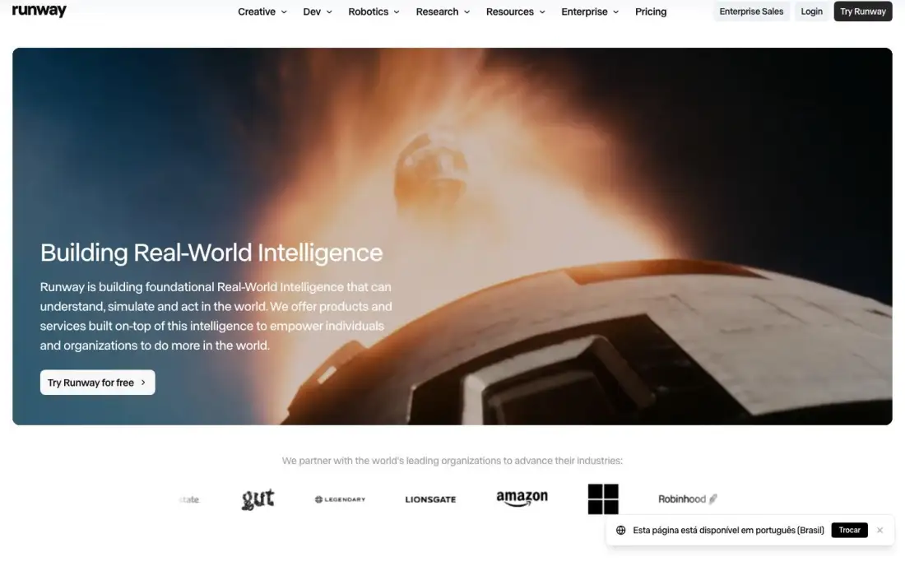
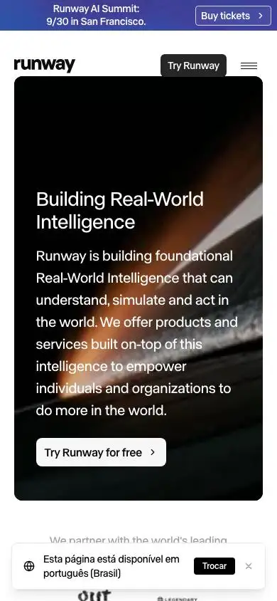

# Runway — technical reference report

## 1. Snapshot
- **URL:** https://runway.com/ · **Captured:** 2026-09-23
- **Pages captured:** home, /product, /enterprise, /pricing, /use-cases, /news, /about
- **Stack:** Next.js. Heavy `<video>` use (product 8, enterprise 3, plus the hero video as a background). No three/GSAP/Lenis detected. Single font family: **ABC Normal**.
- **Verdict:** The reference for a **multi-platform, media-first** AI company that is also **the only one of the four with pt-BR localization** (hreflang pt-BR plus an in-page locale switch prompt). Video-heavy and commercially explicit: persona CTAs, pricing tabs, a big use-case directory. Heavy payloads.

## 2. Positioning & messaging
- **5-second test:** "AI company building 'real-world intelligence' with a free-to-try product" — the H1 over a cinematic video card plus "Try Runway for free" (home-fold). What the product *does* (video generation) is not stated on the fold; it's inferred from the footage.
- **H1:** "Building Real-World Intelligence" (40px, notably small).
- **Subhead:** "Runway is building foundational Real-World Intelligence that can understand…" (a 4-line paragraph).
- **Value-prop structure:** visionary claim → partner logos → "Three platforms built on-top of the same Real-World Intelligence models" (Creative / Dev / Robotics cards, each with its own CTA trio) → tabbed "How Runway is used" showcase → Research band (GWM-1, Gen-4.5) → news → footer.
- **Voice:** visionary-cinematic in headlines; plain and commercial in cards ("Try free, cancel anytime", "Used by 60m+ creatives"). The /use-cases page is SEO-plain ("AI video for whatever you make").

## 3. Information architecture
- **Primary nav:** Creative ▾, Dev ▾, Robotics ▾, Research ▾, Resources ▾, Enterprise ▾, Pricing | Enterprise Sales (grey), Login (grey), **Try Runway** (black). **Nav = one dropdown per platform/audience.**
- **Utility:** top promo bar ("Register now for the Runway AI Summit… Buy tickets", gradient blue), hidden once scrolled (home-fold vs home-darkpref-fold). **Locale toast:** "Esta página está disponível em português (Brasil) · Trocar · ×" bottom-right (every fold).
- **Mobile:** promo bar, logo, **Try Runway kept visible** plus hamburger (home-mobile-fold).
- **Footer (black):** 8 labeled groups: Creative, Dev, Robotics, Enterprise / Research, Resources, Events & Programs, Company. External links marked with ↗ (p5 t01).
- **Page types:** home, product landing, enterprise landing (with form), pricing (tabs), use-case directory, news index, about.
- **Sitemap sketch:** `/` → `/product` (Creative), Dev platform (external ↗), Robotics · `/enterprise` · `/pricing` (Individual / Team & Enterprise / API) · `/use-cases` (+ ~22 child pages) · `/news` (categories, 14 pages) · `/about`, careers.

## 4. Home page anatomy
| # | Section | Job | Layout | Visual device | CTA |
|---|---|---|---|---|---|
| 0 | Promo bar | Event | Full-width gradient strip | Text | Buy tickets |
| 1 | Hero | Vision claim | Rounded full-width card, text bottom-left over media | Background **video** (rocket/space footage; frames differ per capture) | Try Runway for free |
| 2 | Partner logos | Proof | "We partner with the world's leading organizations…" + marquee | Logo marquee (Adobe, Allstate, Lionsgate, Amazon, Microsoft, Robinhood…) | — |
| 3 | Three platforms | Audience routing | Centered H2 + 3 image cards (Creative / Dev / Robotics) | Photos | Per card: Try now / Learn more / For Enterprise · Get API Key / View documentation · Learn more / Contact Sales |
| 4 | How Runway is used | Product showcase | Progress-tab header (Creative/Dev/Robotics) + bordered panel: vertical tab list left, video right | Video (UGC example) | — (tabs) |
| 5 | Runway Research | Credibility / vision | Full-width blurred-gradient card, copy left, 3 linked model rows right | Gradient video bg | Learn more |
| 6 | See the latest | Momentum | 2×2 news cards with thumbnails | Images | Learn more › |
| 7 | Footer | Navigation | Black, 8 groups | — | — |

## 5. Visual system
- **Type:** single grotesk, **ABC Normal**, w400 everywhere (no bold display). H1 40px/46px, −0.5px on home (small, understated); 80px/84px on use-cases and about; pricing 56px/53.8px, −2.5px. Hierarchy comes from size and grey value, not weight.
- **Color:** white bg (body transparent, so page = white), text rgb(64,64,64) grey (not black), strong text rgb(12,12,12). Accent: electric **blue-violet rgb(44,34,250)** only on the "Max / Best value" pricing card and the promo gradient. Everything else is monochrome; color comes from footage.
- **Light/dark:** **light-only** (darkpref identical except for the video frame). Dark sections (research card, footer) supply contrast rhythm.
- **Grid/density:** full-bleed with 20px outer gutter; media cards nearly edge-to-edge with ~16px radii. Medium density; the use-case directory is a dense 4-col text grid (p4 t00).
- **Imagery:** cinematic AI-generated/real video, UGC footage, product photos. The strongest imagery of the group, and it is the product.
- **Buttons:** small 6px-radius chips, grey-filled secondaries, black primaries; pricing uses pill outlines plus blue filled "Get Max".
- **Borders/elevation:** 1px light borders on panels, no shadows; pricing cards use a colored header strip ("Popular" black, "Best value" blue).

## 6. Motion & interaction
- Autoplay background video in the hero and in cards/tabs; 8 videos on /product, 5 media on /enterprise. No 3D.
- Progress-bar tabs (Creative/Dev/Robotics line fills as it auto-advances), vertical tab list switching videos, logo marquee, news carousel dots (enterprise).
- **Weight: heavy.** Byte counts 50–224MB per page (inflated by streamed video, but still an order of magnitude above the others). Home loadMs 10.2s, 315 requests. /use-cases hero video failed to paint (black card, p4 fold): no poster fallback visible.

## 7. Conversion design
- **Header:** Enterprise Sales + Login + Try Runway (primary) on every page; Try Runway persists on mobile next to the hamburger.
- **Per-audience CTA trios** in the platform cards: creators (Try now / Learn more / For Enterprise), developers (**Get API Key** / View documentation / For Enterprise), robotics (Learn more / Contact Sales). Microcopy under the CTA: "Used by 60m+ creatives… Try free, cancel anytime."
- **Enterprise form (the only form, /enterprise):** first name, last name, business email, company, company size (select), industry (select), products of interest (3 checkboxes), message → Submit. ≈8 fields, placed directly under the hero next to a persuasive paragraph (p2 full-page).
- Closing CTAs: "Start making videos today · Try now" (use-cases), "Let's build what's next together · Get in touch" (enterprise).

## 8. Trust & proof
- Partner logo marquee under the hero (home, pricing, enterprise). The "Trusted by 60M+ creators and leading enterprises" line on pricing.
- Enterprise: "Why Enterprises Choose Runway" metric cards ("2 weeks", "80%") with customer names; "Built for Enterprise" list: **We don't train on your data · SOC 2 Type 2 · Customizable access & permissions · Full ownership of your outputs · Single Sign On (SSO)**; case-study carousel ("View all case studies").
- News includes Customer Stories as a category.

## 9. Pricing presentation
- **Segment tabs:** Individual / Team & Enterprise / API, plus a **Monthly ↔ Yearly toggle with a "-20% off" chip** (p3 fold).
- **4 individual plans:** Free $0 · Standard ~~$15~~ $12 · **Pro ~~$35~~ $28 ("Popular", black header strip)** · **Max ~~$95~~ $76 ("Best value", blue, "Credits roll over 1 mo.")**. Two anchors (Popular and Best value), strikethrough monthly price, "Save $X/year" line, credits as the unit.
- **Comparison:** "Compare models across plans". A sticky-header table translating credits into outcomes ("125 videos", "937 images", "500 minutes") grouped by AI video / image / audio with "View more" expanders (p3 t01). Outcome-based comparison, not feature checkmarks.
- FAQ accordion below. JSON-LD: 8× `Offer` + `FAQPage` (the only site with Offer schema).
- Enterprise path: Team & Enterprise tab plus Enterprise Sales in the header.

## 10. Content hub / news
- **Layout:** H1 "News" + large dek ("Behind the models, products and people…") + category tabs (All, Customer Stories, Company News, Safety, Research, Engineering, Developers) + search + **Grid/List view toggle** → featured hero post (image left, big title right) → 3-col grid → numbered pagination (1, 2 … 14) (p5 fold, t01).
- **Card anatomy:** 16:9 branded thumbnail (co-branded "runway | miro" lockups for customer stories), date · category, title. No excerpt, no author.
- Footer on /news reveals full taxonomy of properties (Academy, Help Center, Changelog, AI Festival…).

## 11. Technical & SEO
- **Titles:** keyword-first and commercial: "AI Image and Video Pricing from $12/month | Runway AI", "AI Video Use Cases: Business, Music, Film and Education | Runway", "Runway | AI Image and Video Generator". The strongest SEO titling of the group.
- **Meta descriptions:** unique and keyword-rich.
- **OG:** present on most pages; `og:image` missing on /pricing and /use-cases (null).
- **Canonical:** self. **hreflang:** `en, ja, ko, fr, pt-BR, x-default` on home/product/enterprise/pricing/about; only `en, x-default` on use-cases/news (partial localization declared honestly).
- **Locale UX:** a non-blocking bottom-right toast offering pt-BR ("Trocar"), detected from browser locale, **not an auto-redirect**. Exactly the right pattern.
- **JSON-LD:** home/product = Organization + SoftwareApplication + WebSite; use-cases = Organization + BreadcrumbList + ItemList; pricing = Offer×8 + FAQPage. The best structured-data coverage of the group.
- **Headings:** /product H1 is 16px (a visually tiny/eyebrow H1: "A new frontier for video generation."), which is questionable. The /about H1 is a mission sentence at 80px. Home has only 1 H2 plus 3 H3s (thin outline).
- **Perf (rough):** heaviest of the group: home 10.2s / 315 requests; images 54–105 per page; DOM moderate (583–1,722).
- **Mobile:** hero card keeps text over video; the long subhead takes ~70% of the fold; the locale toast plus promo bar eat ~20% of the viewport (home-mobile-fold).
- **A11y:** body text grey rgb(64,64,64) on white ≈10:1, fine. Text over video relies on footage darkness (no scrim visible on the lighter frames, home-fold). The /news nav rendered with faded labels in the capture (p5 fold), a possible hydration/contrast glitch.

## 12. Steal / Adapt / Avoid for NoctusAI
- **[STEAL]** Locale-suggestion toast ("This page is available in English · Switch" / "Esta página está disponível em português") plus full hreflang with x-default. The exact pattern for NoctusAI pt-BR primary + EN toggle, with no forced redirects (good for SEO crawlers).
- **[STEAL]** "N platforms on one core" section with a per-audience CTA trio per card. Maps directly to NoctusAI's hybrid offer: "Produtos prontos" (Criar conta / Lista de espera) · "IA sob medida" (Falar no WhatsApp) · "Desenvolvedores" (Docs/API).
- **[STEAL]** Keyword-first commercial titles, plus Offer/FAQPage/BreadcrumbList/ItemList schema on pricing and directory pages. The SEO-first playbook.
- **[STEAL]** Use-case directory (a 4-col grid of verticals each linking to its own page: "Real estate", "Clinics & dental"…). A long-tail SEO engine that fits NoctusAI verticals ("IA para imobiliárias", "IA para clínicas de terapia").
- **[STEAL]** Outcome-translated pricing comparison (credits → "125 videos") with segment tabs and a yearly toggle showing the discount chip. Useful if NoctusAI prices AI usage in credits.
- **[ADAPT]** Enterprise trust list ("We don't train on your data · SOC 2 · SSO · Full ownership"): NoctusAI states only what is true ("Dados hospedados no Brasil", "Conforme LGPD", "Seus dados não treinam modelos") and never claims certifications it lacks.
- **[ADAPT]** Enterprise form under the hero: for NoctusAI, a short custom-build brief (nome, WhatsApp, empresa, tipo de projeto, mensagem, ≤5 fields) whose submit opens a prefilled WhatsApp. No demo scheduling.
- **[ADAPT]** Progress-bar auto-advancing tabs for a "Produtos" showcase, but using lightweight looping WebM/poster or DOM mockups instead of heavy video.
- **[AVOID]** 50–220MB pages and a 10s home load: incompatible with Lighthouse ≥90. NoctusAI keeps motion concentrated in one lazy WebGL hero with a static poster.
- **[AVOID]** Video heroes without poster fallback (black /use-cases hero) and text over unscrimmed footage: always provide a poster plus a contrast scrim.
- **[AVOID]** A 40px understated H1 plus a 4-line abstract subhead on the fold: SMB visitors need a concrete pt-BR "what it does" in ≤15 words.
- **[AVOID]** Stacking promo bar + locale toast + cookie banner on mobile: cap overlays to one at a time (consent first, locale toast after).
