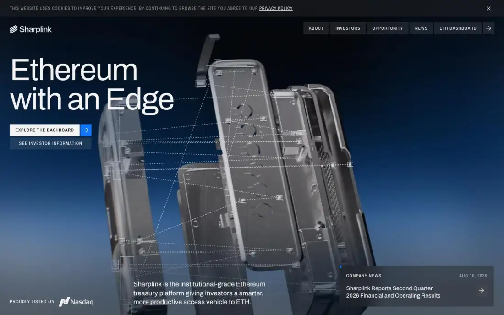
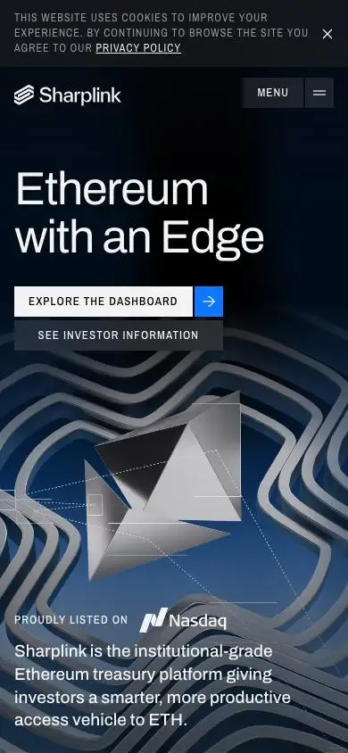

# Sharplink — sharplink.com (Awwwards SOTD 2026-08-27)

> Tile note: home-t04 is a full-page thumbnail; tiles cited by filename. Large empty gradient stretches in home-t02/t03 are a pinned, scroll-scrubbed section (see §6).

## 1. Snapshot
- **URL:** https://www.sharplink.com/ · **Captured:** 2026-09-23
- **Pages:** home, /about, /investors, /news, /contact (5)
- **Stack (detected):** framework not fingerprinted (26 stylesheets and a noscript "requires JavaScript" block point to a client-rendered SPA); Storyblok CMS; Lenis; WebGL canvases (3 on home); **3 `<video>`** on home (CGI loops); an embedded third-party IR widget (EQS-style forms on investors/news). Fonts: Archivo + Archivo Narrow.
- **Verdict:** Institutional-fintech gravitas through photoreal CGI video (brushed-metal "exploded" ETH hardware) plus HTML/SVG annotation overlays. It's beautiful and on-brand, but it's the weakest SEO hygiene in the group: no canonical, the noscript text registers as the H1, and an implied-consent cookie bar.

## 2. Positioning & messaging
- **5-second test:** passes on the fold. The H1 "Ethereum with an Edge" plus a bottom sub-line explaining the "institutional-grade Ethereum treasury platform", a Nasdaq "proudly listed" badge, and a live company-news card (home-fold).
- **Voice:** institutional and confident, with wordplay headlines ("The Stack for Stacking Ethereum", "Engineered to Compound") and proposition labels (LEADERSHIP, EQUITY, TRANSPARENCY, COLLABORATION).

## 3. Information architecture
- **Nav:** logo left; right-aligned **segmented button bar** (About · Investors · Opportunity · News · ETH Dashboard) plus an arrow block; the active item is marked with a blue square (p1-about-fold). Mobile uses MENU + burger (home-mobile-fold).
- **Footer (t04 thumb):** dark gradient, Nasdaq ticker info, privacy/terms, newsletter email field.
- **Page types:** landing, about (leadership/board grid), investor relations (press releases, governance, SEC filings, analyst coverage, IR widget), news listing, contact.
- **Sitemap sketch:** `/` · `/about` · `/investors` · `/opportunity` · `/news` (+ posts) · `/contact` · external ETH dashboard.

## 4. Home page anatomy
| # | Section | Purpose | Layout pattern | Visual device | CTA |
|---|---|---|---|---|---|
| 0 | Cookie bar (fold) | Legal | Full-width top strip, implied consent ("by continuing to browse…") | Mono caps | × |
| 1 | Hero (fold) | Promise + legitimacy | Full-bleed CGI video; H1 top-left; CTA stack under the H1; sub-line bottom-centre; Nasdaq badge bottom-left; news card bottom-right | Exploded brushed-metal hardware with **dotted connector lines and bounding-box callouts** (HUD overlay) | EXPLORE THE DASHBOARD (white + blue arrow cell) · SEE INVESTOR INFORMATION |
| 2 | The Stack for Stacking Ethereum (t01) | 5 propositions | Left list (label, H3, blurb) + right sticky 3D object (a glass/metal "stack" canister) | Background gradient shifts from off-white to deep blue as you scroll; inactive items dimmed | — |
| 3 | Ethereum for Everyone, Engineered to Compound (t02) | Brand statement + re-CTA | Framed dark card with blueprint corner markers | Two-tone headline (white + grey) | EXPLORE THE DASHBOARD · SEE INVESTOR INFORMATION |
| 4 | The Opportunity of a Generation (t02, t03) | 4 "Ethereum is…" theses | **Pinned, scroll-scrubbed** stage: ~3,000px of blue-radial gradient where the content is animated in (H3s exist in DOM but are invisible in the capture) | Gradient "planet horizon" glow | LEARN MORE → |
| 5 | Latest News (t03) | Freshness | 3-col card grid with dotted column rules (only 1 post) | Co-branded post art | VISIT OUR BLOG → |
| 6 | FAQ (t04 thumb) | Objection handling | Right-aligned numbered accordion (7 Qs) | Mono numbering | REACH US → |
| 7 | Footer | Legal / IR / newsletter | Dark gradient | — | email subscribe |

## 5. Visual system
- **Typography:** the extract's H1 metrics (Archivo 32px) are the *noscript message*. The visual H1 is Archivo ~88px, tight leading, regular weight, white on dark (home-fold). Labels and buttons use Archivo (Narrow) caps with wide tracking. It's a single-family system.
- **Color:** off-white `#F7F7F5` / `#F3F3F3` page; black; a single **electric blue `#0E76FF`** used only for arrow cells, active-nav squares and the blueprint corner markers; deep navy→sky radial gradients as atmosphere; low-alpha greys for dimmed copy.
- **Light/dark:** no toggle, and the dark pref is identical. The page transitions *by scroll* from dark hero → light section → gradient into dark → light again (t01–t03). The theme is choreographed rather than user-controlled.
- **Grid/whitespace:** 4-col with dotted hairline column guides visible in some sections (t03 news). Generous vertical air (sometimes excessive: see §6).
- **Imagery / art direction:** **photoreal chrome/aluminium CGI** (exploded device, ETH octahedron, glass canister) with a HUD layer of dotted leader lines and rectangles. It reads as "engineered, audited, precise". The same language continues on about (ETH diamond with callout boxes, p1-about-fold).
- **Iconography:** minimal (arrows, small blue squares, outline logo mark).
- **Radii/elevation:** 0 radius; flat; the blueprint "corner tick" frame is the signature (t02).

## 6. Motion & interaction
- **Observed:** 3 videos on home (hero CGI loop; mobile shows a different frame, the ETH diamond in chrome rings, which confirms a looping video, home-mobile-fold) and 3 WebGL canvases (likely the gradient field + the stack object or overlay lines). Lenis. FAQ accordion. Scroll-state styling (dimmed vs active proposition, t01).
- **Inferred:** section 4 is a **pinned scrollytelling** block. ~3,000px of empty gradient in the static capture (t02 bottom → t03 top) means the text is driven by scroll progress. The stack canister is probably scroll-rotated/exploded. The HUD lines probably draw on.
- **Weight:** home ~14.8MB counted (video-dominated), 109 requests, 3.1s. Subpages 0.2–5.4MB. Video is the budget sink, but load time stays OK.

## 7. Conversion design
- There are two persistent paths, **Dashboard** (product/data) and **Investor information**, repeated as a pair in the hero and mid-page (t02). The white primary button has an attached blue arrow cell, so it reads well as a component.
- A news card in the hero is a clever "freshness" CTA. Newsletter email appears in the footer. IR forms come from a third-party widget.

## 8. Trust & proof
- Nasdaq listing badge in the fold; named leadership and board (with ex-BlackRock, Ethereum co-founder); partners (Consensys, MetaMask, Linea); SEC filings, governance and analyst coverage; a public ETH dashboard as "real-time clarity". Proof comes from **regulatory transparency**, the institutional analogue of the security/compliance block.

## 9. Pricing
- Not applicable.

## 10. Content hub / blog
- `/news`: dark hero "Latest News", Featured Blog + Most Recent columns, press releases (p3-news-fold). Thin content (one post repeated as featured, recent and all). The meta description on /news is literally "Description". It's an example of a hub shipped before content exists.

## 11. Technical & SEO
- **Meta:** titles in the pattern "Sharplink : Home" (brand-first, no keywords); **no canonical on any page**; **`lang` empty**; no hreflang; OG image reused site-wide; the /news meta description is a placeholder.
- **JSON-LD:** only ItemList on investors/news; no Organization/Corporation.
- **Headings:** the **first H2 and H1 are the noscript message** ("Please enable JavaScript" / "This website requires JavaScript…"), so every page has two H1s and the first one is junk. The real H1 is repeated ("Ethereum with an Edge" ×2).
- **Text in canvas/video:** the propositions are HTML, but section 4 text is invisible without scroll-scrub. Hero callout boxes are decorative. There's a legibility risk where grey copy sits on the mid-blue gradient (t01, "Treasury as an Operating System" is near-invisible).
- **Perf:** DOM 0.5–2.9k; 16–28 stylesheets per page (unbundled CSS).
- **Mobile:** well composed. H1 + CTAs sit above the video subject; badge and sub-line are at the bottom (home-mobile-fold). The cookie bar consumes about 75px.
- **Consent:** an **implied-consent cookie banner**, which is non-compliant for LGPD/GDPR opt-in analytics.

## 12. Steal / Adapt / Avoid for NoctusAI
- **[STEAL]** HUD/annotation overlay (dotted leader lines + bounding boxes) on a 3D object, pointing at named parts. For NoctusAI, the interactive 3D hero can annotate "modules" (products) with HTML labels that are crawlable, translatable and themeable.
- **[STEAL]** The primary-button + attached arrow-cell component and a repeated two-path CTA pair (for NoctusAI: WhatsApp + Cadastro/Waitlist).
- **[ADAPT]** A live "latest news" card in the hero corner. It fits NoctusAI as a "latest product/blog update" card that the admin can toggle.
- **[ADAPT]** Sticky 3D object + left proposition list with active/dimmed states for the "custom builds" section. Keep the dimmed copy at WCAG AA contrast in both themes.
- **[ADAPT]** Proof via transparency (listing, governance, dashboard). NoctusAI's equivalent is a public status page, an LGPD/DPA page, and a changelog.
- **[AVOID]** Pinned scroll-scrubbed stages that leave 3,000px of empty gradient in static renders. That's poor for prerendered SEO snapshots, reduced-motion users and Lighthouse CLS/LCP.
- **[AVOID]** Missing canonical and `lang`, brand-first titles, placeholder meta, and a noscript message counted as the H1. Prerendered HTML with real content makes noscript banners unnecessary.
- **[AVOID]** An implied-consent cookie bar. NoctusAI decided on LGPD opt-in before GA4/Meta Pixel.
- **[AVOID]** Shipping a news hub with one post. Hide the blog section via admin toggle until real posts exist.
