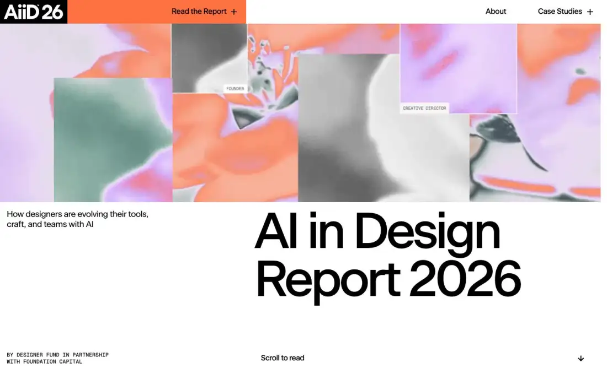
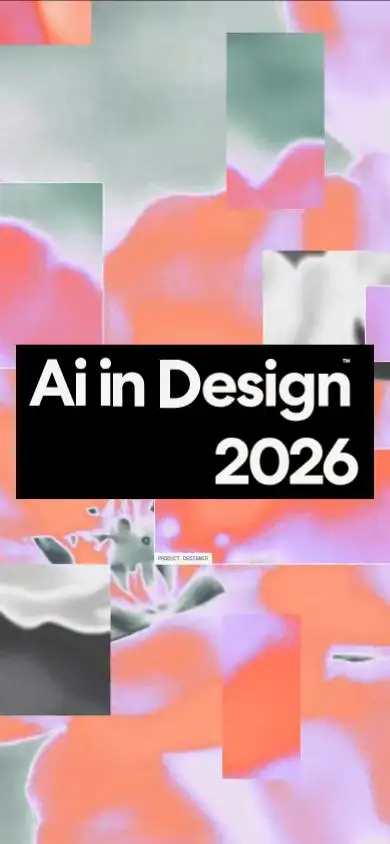

# AI in Design Report 2026 — stateofaidesign.com (Awwwards SOTD 2026-08-26)

> Tile note: home-t06 is a full-page thumbnail; tiles cited by filename. Large blank regions in home-t00/t03 are scroll-reveal content that never fired in the headless capture (see §6).

## 1. Snapshot
- **URL:** https://stateofaidesign.com/ · **Captured:** 2026-09-23
- **Pages:** home, /about, /chapters/tools, /chapters/craft, /chapters/teams, /cases/sierra (6)
- **Stack (detected):** **Framer** (hosted, SSR'd HTML), Framer appear/scroll effects, 2–6 `<video>` per page, no WebGL/canvas, no Lenis/GSAP. Fonts: Beausite Classic (Medium/Regular/Bold), Inter, Geist Mono. It's a report microsite by Designer Fund + Foundation Capital.
- **Verdict:** An editorial long-read with a strong art-direction system: AI-mutated flower imagery, a colour per chapter and ASCII/dither video. It's excellent for data storytelling and the content hub, but it's heavy (27–42MB on media-heavy pages), has no `lang`, and has no schema.

## 2. Positioning & messaging
- **5-second test:** passes. The H1 "AI in Design Report 2026" plus the sub "How designers are evolving their tools, craft, and teams with AI" and the byline (home-fold).
- **Voice:** journalistic, data-led and warm. Chapter titles are headline-style ("The great toolstack shakeup", "Craft in the age of infinite output"). Numbered findings are used as H1s ("1. Frequent AI usage jumped from 54% to 91%…").

## 3. Information architecture
- **Nav (home-fold):** black AiiD26 logo block · an orange "Read the Report +" mega-dropdown (Tools 01 / Craft 02 / Teams 03) · About · "Case Studies +" dropdown (Sierra, Linear, Shopify, Stripe, with Anthropic/Notion/Framer marked "Coming soon").
- **Footer (t05, t06):** newsletter/markdown download block, methodology stats, giant "Ai in Design 2026" wordmark, link columns.
- **Page types:** report landing, chapter long-read (25k–33k px tall, 4–6k words), video case study, about/methodology.
- **Sitemap sketch:** `/` → `/chapters/{tools,craft,teams}` · `/cases/{sierra,linear,shopify,stripe,…}` · `/about`.

## 4. Home page anatomy
| # | Section | Purpose | Layout pattern | Visual device | CTA |
|---|---|---|---|---|---|
| 1 | Hero (fold) | Title + framing | Top band of overlapping image collage; below, sub-line left and giant H1 right | AI-mutated flower imagery in orange/lilac/sage collage tiles, labelled with role tags ("FOUNDER", "CREATIVE DIRECTOR") | "Scroll to read ↓" |
| 2 | Partner logos (t06 thumb) | Credibility | Single row of logos (Notion, Canva, Framer, Linear, Anthropic, Shopify, Stripe) | Mono logos | — |
| 3 | Thesis (t06) | Key message | Large 2-line statement | Type only | — |
| 4 | Intro video + about (t01) | Human face + method | Full-width video still (autoplay, inferred), then an offset text column | Documentary interview footage | "Sign up for new releases" (inline link) |
| 5 | Pull quote (t02) | Emotion | Black cell with a small portrait + sage cell with a big quote | Split colour cells | — |
| 6 | Chapter 01 Tools (t02, t00) | Chapter teaser | Orange full-bleed panel: "01 Tools" huge left, title + abstract right, dither image + "In this chapter" list | Chapter colour + ASCII/dither flower | Read the Tools Chapter → (black full-width bar) |
| 7 | Chapters 02, 03 (t03 **blank**) | Chapter teasers | Presumably the same pattern in lilac/sage (H2s "02 Craft", "03 Teams" exist in DOM) | Hidden: scroll-triggered reveal never fired | — |
| 8 | Video case studies (t04) | Social proof / content | Header + arrow carousel of 3 video cards with a lilac underline | Documentary stills | card → case |
| 9 | Coming soon (t04, t05) | Anticipation | Large video still + text | Play button | Get notified → |
| 10 | Newsletter (t05) | Lead capture | Black panel, centred form | Offer = "report markdown" download | Submit (orange) |
| 11 | Methodology + footer (t05) | Credibility + brand | 4-col stat row (906 / 25+ / 50+) then a giant wordmark | Oversized type | — |

## 5. Visual system
- **Typography:** H1 is Beausite Classic Medium **120px / 114px lh (0.95), w500, tracking −7.2px (−6%)**. The about H1 is 50px, the case-study H1 40px. Body is Inter ~16px. Labels are in Geist Mono uppercase. The tight negative tracking and sub-1 leading make a dense, poster-like headline.
- **Color:** black/white base; link blue `#0000EE` (default browser link colour kept on purpose, ×358). The chapter/brand accents are **orange `#FE7141`**, **lilac `#CDABFE`**, **sage `#D1DDD3`**, used as full-bleed section fields and chart series.
- **Light/dark:** light only; no toggle; the dark-pref capture is identical. Black panels are used for the newsletter and footer.
- **Grid/whitespace:** a 2-column split (left ~40% for labels/numbers, right ~60% for reading text). The chapter body sets the reading column at ~690px on the right, with the left column empty (p2-chapters-tools-t01), which works as a comfortable measure for long reads.
- **Imagery / art direction:** a single visual metaphor: **flowers mutated by AI** (thermal/solarised colour), with ASCII/dither versions of the same images and documentary video for humans. Each chapter hero pairs an ASCII panel with a thermal photo (p2-chapters-tools-fold). The case study pairs an ASCII portrait with real video (p5-cases-sierra-fold).
- **Data viz:** flat, square-cornered bars in lilac, orange, slate and blue with direct labels, source lines and "+Npts" deltas (p2 t01, t02). There's a big "91% vs 54%" area comparison block.
- **Radii/elevation:** zero radius; flat; hairline rules.

## 6. Motion & interaction
- **Observed:** multiple `<video>` elements per page (home 6, with 12 media requests). There is **no canvas**, so the ASCII/dither look is baked into video or image assets, not rendered live. Dropdown menus; carousel arrows; play buttons on case videos.
- **Observed artifacts:** long blank stretches (home t00 lower half, **t03 entirely white**, t04 top) where Framer "appear" animations didn't trigger in the headless full-page capture. The DOM does contain the chapter 02/03 H2s, so crawlers get the text, but the no-JS / no-scroll visual state is empty. Mobile fold (home-mobile-fold) shows a full-screen intro splash (collage + black "Ai in Design 2026" block) covering content.
- **Inferred:** the hero collage tiles probably animate (shuffle/scale). Chapter sections probably reveal on scroll.
- **Weight:** home ~33MB counted (12 media), tools chapter ~42MB, sierra ~35MB. Load 2–6s on a fast connection. Video dominates the bytes, so this is the "wow via video" cost profile.

## 7. Conversion design
- There's one conversion: **email capture**, with a strong content offer ("Download the markdown version of the report, ready to drop into any tool", home t05) and a clear consent line naming both sponsors. Secondary actions are "Get notified" links for upcoming case studies.
- The form is reused as a footer module on every page. Extract lists 12 text inputs, but that's Framer hidden fields; only an email field is visible.

## 8. Trust & proof
- Partner brand logos (companies featured), a methodology stat row (906 survey responses, 25+ interviews, 50+ sources), an anonymised-quote policy note (p2 t02), named project credits on about, and sponsor attribution. Proof comes from **research methodology**, not customers.

## 9. Pricing
- Not applicable.

## 10. Content hub / blog
- The site *is* a content hub. Chapter pages act as long-form articles with numbered findings, charts with sources, pull quotes, "A closer look" case callouts (p2 t02), "Key takeaways", "Relevant posts & resources" and a newsletter footer. Reading time is shown ("Reading time: 25 min", chapter fold).
- This is the best template in the set for the NoctusAI blog's flagship pieces (e.g. a "State of AI in Brazilian SMBs" report).

## 11. Technical & SEO
- **Meta:** good titles/descriptions and per-page OG images (chapter-specific); canonical set; **`lang` empty on `<html>`**; **no JSON-LD at all** (it should have Article/Report, Organization, VideoObject); no hreflang.
- **Headings:** **multiple H1s per page** (home: 5 H1s, chapter pages: ~8 H1s, used for every numbered finding). H2 is used for tiny labels ("01", "VIDEO CASE STUDIES"). The outline is broken, though the keywords are present.
- **Text in canvas:** none (no canvas). ASCII art is video/image, which is decorative, so it's fine.
- **Perf:** DOM 1.0–4.1k nodes; bytes very heavy (see §6); body font computed as `sans-serif 12px` at the root (Framer default), so real type styles are per-component.
- **Mobile:** the intro splash covers the fold; the layout stacks.
- **Reduced motion / no-JS:** appear-on-scroll leaves blank regions in static renders. That's a Lighthouse/CLS risk and bad for social/print previews.

## 12. Steal / Adapt / Avoid for NoctusAI
- **[STEAL]** Chapter-colour system: each product vertical or blog pillar owns one accent field (orange / lilac / sage equivalents in the new brand). It's legible, themeable, and supports admin-hideable sections.
- **[STEAL]** The long-read template: numbered findings, direct-labelled flat charts with sources, pull quotes, "a closer look" callouts, key takeaways and reading time. Use it for SEO flagship articles in pt-BR.
- **[STEAL]** Lead magnet as the waitlist hook: "download the report in markdown / get notified". A good fit for waitlist + newsletter without demo booking.
- **[ADAPT]** One art-direction metaphor rendered in two modes (a "real" image plus an ASCII/dither twin). NoctusAI can pair each product screenshot with a dither twin, giving motion-free richness that works in light and dark.
- **[ADAPT]** Mega-dropdown nav listing chapters with numbers, reused for "Produtos 01–0N" and marked "em breve" for unreleased verticals (honest, no fabricated proof).
- **[ADAPT]** Methodology-stat row as proof that isn't testimonials. For NoctusAI: real platform facts only (products live, uptime, LGPD) and never invented numbers.
- **[AVOID]** Multiple H1s and an empty `lang`. NoctusAI needs `lang="pt-BR"` / `en` + hreflang pairs and one H1 per page.
- **[AVOID]** 30–40MB video payloads and appear-on-scroll that blanks static renders. Use posters + `preload="none"` + a click-to-play/IntersectionObserver lazy video, and SSR visible final states.
- **[AVOID]** Shipping without JSON-LD. Add Article, Organization, BreadcrumbList and VideoObject from day one.
