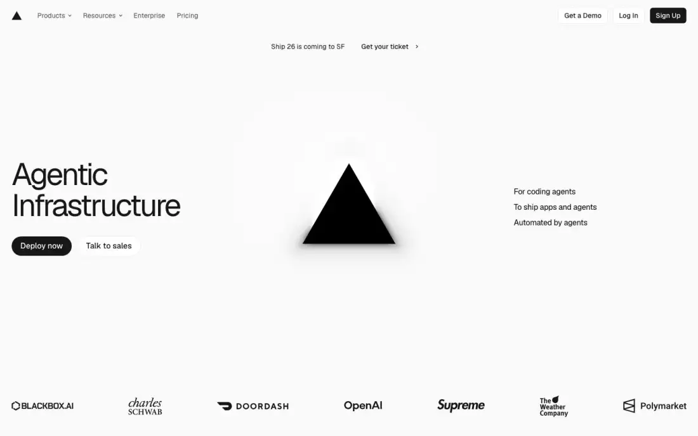
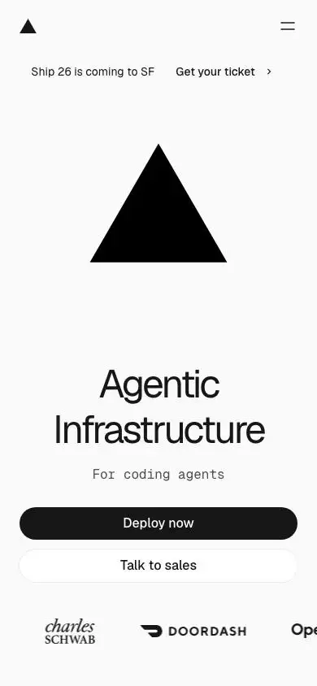
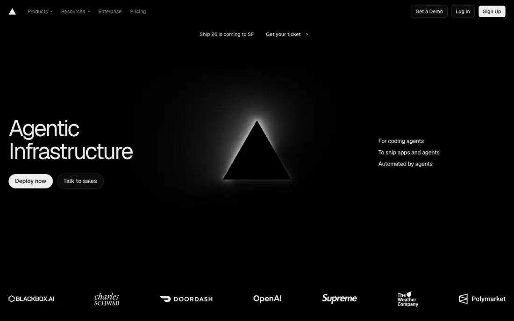

# Vercel — technical reference report

## 1. Snapshot
- **URL:** https://vercel.com/ · **Captured:** 2026-09-23
- **Pages captured:** home, /ai-sdk, /ai-gateway, /sandbox, /passport, /blog, /pricing
- **Stack:** Next.js. One `<canvas>` on home (hero triangle glow). No three/GSAP/Lenis/Lottie detected. Fonts: GeistSans + Geist Mono (own typeface family).
- **Capture note:** the full-page tiles show large blank bands (home t01–t02, /ai-gateway t02, /sandbox t01) because sections render only when scrolled into view. A second pass of viewport frames taken while wheel-scrolling (`scroll/home-s00..s06`, `ai-gateway-s00..s19`, `sandbox-s00..s15`) shows all of it. Everything below is observed, not inferred.
- **Verdict:** The reference for a **theme-aware**, dev-first, multi-product platform site. Monochrome Geist system, code-as-hero, excellent pricing, product sub-nav and calculator patterns. Its weak spot is content gated behind JS reveals (blank in static capture).

## 2. Positioning & messaging
- **5-second test:** "infrastructure for AI agents and apps" — H1 plus the triangle logo-as-hero plus 3 right-column taglines ("For coding agents / To ship apps and agents / Automated by agents") (home-fold). Abstract. Needs prior brand knowledge.
- **H1:** "Agentic Infrastructure" (64px). No subhead paragraph; the 3-line tagline list does that job.
- **Subpage H1s are the stronger model:** "The AI GATEWAY for developers" with subhead "Hundreds of models, one API key, no markup." (p3 fold); "The safest way to run code you didn't write" (p4 fold).
- **Value-prop structure:** home = 3 pillars as H2s: "Build agents on infrastructure that thinks like them" (scroll home-s01), "Ship apps that scale from zero to millions instantly" (home-s02), "Host platforms that serve every customer" (home-s03). Each has **one customer-proof sentence with a number** (Notion "millions of agent conversations daily", Zapier "over 100 million monthly website visits", Mintlify "documentation for over 20,000 companies"), a 4-item Features list and a mockup of that customer's product. Then "Recently shipped", then the closing "Built by you, or your agents".
- **Voice:** terse, engineering-confident, benefit-plus-number. Two-tone sentences (black lead plus grey tail).

## 3. Information architecture
- **Primary nav:** Products ▾ (mega-menu: AI SDK, AI Gateway, Sandbox, Passport, Connect, eve, Security, CDN, Fluid Compute, Observability, Workflows, CI/CD, Next.js, Vercel Agent…), Resources ▾ (Docs, Blog, Changelog, Knowledge Base, solutions pages, Customers, Marketplace, Partner Finder), Enterprise, Pricing | Get a Demo (outline), Log In (outline), **Sign Up** (filled black).
- **Secondary:** announcement line under nav ("Ship 26 is coming to SF · Get your ticket ›"). Per-product **sticky sub-nav** ("AI GATEWAY: Overview · Models · Leaderboards · Docs ↗") that stays pinned while scrolling (every ai-gateway-sNN frame). /sandbox has no sub-nav.
- **Footer (observed, scroll home-s06 / sandbox-s15):** **same light background as the page** (not a dark band), 12 labeled columns in 2 rows: Agent Stack, Core Platform, Security, Tools, Frameworks, SDKs / Build, Learn, Explore, Company, Legal & Trust, Social. Grey **"New" pills** on recently launched items (Connect, Passport, eve, Workflow SDK…). The bottom row has the triangle, an **"● ALL SYSTEMS NORMAL."** live status line in mono blue, and a **3-state theme switcher (system / light / dark)** bottom-right (sandbox-s15).
- **Page types:** abstract brand home, product landing (×4), blog index, pricing.
- **Sitemap sketch:** `/` → `/ai-sdk`, `/ai-gateway` (+ models/leaderboards), `/sandbox`, `/passport` · `/blog` (filters) · `/pricing` · `/enterprise` · docs (external).

## 4. Home page anatomy (observed via scroll frames)
| # | Section | Job | Layout | Visual device | CTA |
|---|---|---|---|---|---|
| 0 | Announcement line | Event promo | Centered text link under nav | Text | Get your ticket › |
| 1 | Hero | Category claim | 3-col: H1+CTAs left / logo center / taglines right | Canvas-glow triangle (light: drop shadow; dark: rim-light) | Deploy now (filled) + Talk to sales (outline) |
| 2 | Logo strip | Proof | 7 logos, full width | Monochrome logos | — |
| 3 | Build agents (home-s01) | Pillar 1 | H2 top-left; overlapping mockup cards center; proof sentence + Features list right | Notion doc + "New AI chat" panel UI mockup | Feature links (Durable Orchestration, Sandboxed Environments, AI Model Gateway, Fluid Compute) |
| 4 | Ship apps (home-s02/s03) | Pillar 2 | Mirrored: proof+features left, H2+mockup right | Zapier landing-page mockup incl. its stats row (450K+ / 9,000+ / 3.39M+) | Feature links |
| 5 | Host platforms (home-s03/s04) | Pillar 3 | H2 left; wide mockup left, proof + features right | Mintlify docs-site mockup (sidebar, grid-line illustration cards) | Feature links (Tenant Isolation, Domain Management, Custom SSL, Preview URLs) |
| 6 | Recently shipped (home-s04/s05) | Momentum | H2 + 2-col bento of bordered cards | eve card (line-art logo); Passport card (black passport object); Containers card (terminal log: "▲ vercel deploy… ✓ Deployed to Fluid compute") | Cards link to product pages |
| 7 | Built by you, or your agents (home-s05) | Closing CTA | Centered H2, 2 buttons | Text | **Deploy now** (filled) + **"Onboard your agent"** pill with 3 agent logos + copy icon (copies an agent-onboarding prompt) |
| 8 | Footer (home-s06) | Navigation + utilities | Light, 12 columns; status line + theme switcher | — | — |

## 5. Visual system
- **Type:** GeistSans. H1 64px/64px, w400 (home) / w450 (subpages), tracking **−3.84px (−0.06em)**, very tight. Passport H1 72px/−4.32px. Blog H1 48/56. Geist Mono for eyebrow labels ("AI GATEWAY"), code, the mobile tagline and the footer status line. A **pixel/bitmap mono display face for big numbers** ("0%", "20x", "30s", "25%": ai-gateway-s01, s08). A pill-outlined word inside the H1 ("The AI (GATEWAY) for developers") is a signature device.
- **Color:** light bg rgb(250,250,250), fg rgb(23,23,23), secondary rgb(77,77,77). Accent blue rgb(0,114,245) used ~1× per page (links/toggles/status dot). Red/amber/green only as data or status. Essentially monochrome. A single multicolor gradient orb stands for "Realtime" (ai-gateway-s13).
- **Light/dark:** **honors prefers-color-scheme.** The darkpref fold flips to a black bg, white text, inverted buttons and a rim-lit triangle (home-darkpref-fold). **Explicit 3-state theme switcher (system/light/dark) exists, but only in the footer** (sandbox-s15); nothing in the header.
- **Grid/density:** full-bleed 1440 with only a 24px gutter. Recurring layout: H2 left (~40%) plus explanatory paragraph right, then a full-width bordered 3-cell bento. Generous vertical gaps (~300–500px) between sections.
- **Imagery:** customer product mockups (Notion, Zapier, Mintlify) inside browser frames, code editors, node/flow diagrams (API hub fan-out, fallback routing: ai-gateway-s04/s05), stacked-window isometric grid for Fluid compute (sandbox-s09), a passport object. No photography.
- **Icons:** Geist monoline 16px icons in feature lists and security rows (lock, fingerprint, check: ai-gateway-s09).
- **Borders/radii:** 1px light-grey borders, ~8–12px radii on cards; full-pill hero and closing buttons vs 6px-radius header buttons. Minimal shadow except floating mockups.

## 6. Motion & interaction
- **Canvas hero:** a single canvas for the triangle glow (grain/glow differs per theme). A lightweight "3D-feel" with no WebGL scene.
- **Reveal-on-scroll:** confirmed. Sections paint only once in the viewport (blank in the static full-page capture, present in scroll frames).
- **Interactive demos (observed):**
  - Tabbed code blocks (API / Claude Code / Codex… × AI SDK / Chat Completions… × TypeScript / Python) with "Copy for agent" (p3 fold).
  - Model picker plus "Use With AI Gateway" toggle (p2 fold).
  - Routing diagram with Availability/Costs/Latency tabs (p3 t01).
  - Per-modality live demo bubbles (streaming text, gradient orb for realtime, embeddings vector dump: ai-gateway-s11/s13/s15).
  - Package-manager tabs (npm/yarn/pnpm/bun) in a numbered quickstart (ai-gateway-s19).
  - Sandbox "Play demo".
  - **Sandbox cost calculator:** a "Sandbox hours" slider (0–100,000) drives a competitor bar chart (Vercel $2,760 "Lowest" vs Daytona, E2B, Blaxel, Modal) and an itemized "Pricing breakdown" (Active CPU, Provisioned Memory) with a big mono total (sandbox-s10/s11).
  - Numbered FAQ accordion (sandbox-s13).
- **Perceived weight:** medium. Interactive, but no heavy media (≈0.2–0.4MB per page transfer).

## 7. Conversion design
- **Header CTAs on every page:** Get a Demo (outline), Log In (outline), Sign Up (filled). Plus an "Ask AI" assistant.
- **Hero CTAs:** always a filled primary plus an outline secondary: Deploy now / Talk to sales; Get API key / Read the docs; Get started / See examples; Read the docs + `$ npm i ai` copy-chip.
- **Closing CTA (home-s05):** "Built by you, or your agents": Deploy now plus "Onboard your agent" (a copy-to-clipboard pill with Claude/OpenAI/Cursor-style marks). **The agent itself is treated as a conversion target.**
- **Developer micro-CTAs:** "Copy CLI code" (`npx sandbox create --connect`), "Copy AI prompt" (a full bootstrap prompt shown in a panel), "Copy for agent", `npx vercel ai-gateway setup` terminal (sandbox-s12, ai-gateway-s17). The copy button *is* the conversion.
- **Product-page "Get started" sections:** /ai-gateway ends in a numbered 01/02/03 quickstart (init → install deps → set API key, ai-gateway-s19); /sandbox ends in "Get started" plus "See more examples" and the two copy CTAs (sandbox-s12).
- Mid-page secondary CTAs: "View all deals" (promotions), "View the changelog" (Recent ships), "See all supported coding agents".
- **Forms:** none on captured pages. Sales goes to separate routes.
- **Audience paths:** dev (Sign up / docs / npm / copy-prompt), enterprise (Talk to sales / Get a Demo), per-product sub-nav.

## 8. Trust & proof
- Logo strip under the hero on home and on each product page (different logos per product: Notion, Poke, Sentry… on /sandbox).
- **Proof fused into feature sections:** customer name plus scale metric plus their product mockup, three times on home (Notion, Zapier, Mintlify: home-s01–s03).
- **Case-study metric row:** big pixel-mono stats "20x / 30s / 25%" with captions, linked "How Zo Computer improved AI reliability 20×" (ai-gateway-s08). Preceded by a large centered pull-quote with the customer logo and "Rob Cheung, Co-founder" (ai-gateway-s07).
- /sandbox: 2-up testimonial quotes (Xata CTO, Cua founder) with logos (sandbox-s10).
- **Security as a feature section:** "Security and compliance" H2 then 3 icon rows: **Zero Data Retention · No training on your data · Provider allowlist** (ai-gateway-s08/s09). "Take control": budgets, API key management, OIDC tokens, reporting API, observability, request logs (ai-gateway-s09).
- "Recent ships" changelog cards with date, "Changelog" tag, title and author avatars (ai-gateway-s06/s07).
- Footer "ALL SYSTEMS NORMAL" status line as ambient reliability proof (sandbox-s15).

## 9. Pricing presentation
- **3 plans:** Hobby $0 · Pro $20/mo ("Popular" badge = anchor) · Enterprise "Custom" (p7 fold). Equal-width bordered cells sharing borders.
- **Card anatomy:** name, price, one-line who-for, divider, icon plus feature list ("All Hobby features, plus:" inheritance), CTA at the bottom (Start deploying / **Start a free trial** (filled) / Get a demo).
- **Toggle:** none (usage-based). **Comparison table:** very long, grouped by product (Delivery Network, Firewall, Compute, AI, Build & Deploy, Observability, Security, Compliance) with check marks, "Up to N" values, "Regional pricing ↗" links and info-tooltips (p7 t01).
- FAQ plus "Can't decide?" closing section. Enterprise path: Contact Sales / Talk to sales.
- **Product-page pricing:**
  - AI Gateway: "0% · No markup on tokens · Pay provider prices, never a cent more" (ai-gateway-s01).
  - AI Gateway: a promotions module ("22 live now", View all deals) with strikethrough model prices (p3 t01).
  - AI Gateway: a sample invoice bento showing provider line items plus "Platform fee $0.00" (ai-gateway-s05).
  - Sandbox: the **interactive calculator with competitor comparison** (sandbox-s10/s11).

## 10. Content hub / blog
- **Layout:** H1 "Blog", pill filter tabs (All, Engineering, Community, Company News, Customers, v0, Security, Changelog, Press), search plus RSS icon, "Featured articles" 3-col white cards then "Blog posts" list, "Show more posts" (p6 fold).
- **Card anatomy:** date ("18 September") plus category, **large title as the visual** (no thumbnail), 2-line excerpt, stacked author avatars plus names. The same card component is reused for "Recent ships" on product pages (ai-gateway-s07): one card system across blog, changelog and product pages.
- **Taxonomy:** category chips; changelog is its own stream but surfaced as a filter.

## 11. Technical & SEO
- **Titles:** `Page - Vercel` ("Agentic Infrastructure - Vercel", "AI Gateway - Vercel"). Pricing is keyword-rich: "Vercel Pricing: Hobby, Pro, and Enterprise plans".
- **Meta description:** present. The /ai-sdk description is stale ("Frontend Cloud" copy), so meta drift exists even here.
- **OG:** unique per-product OG images on blob storage; summary_large_image.
- **Canonical:** self. **hreflang:** none captured; `langSwitcher` detected on /ai-gateway and /blog.
- **JSON-LD:** home = Organization + Service + SoftwareApplication. /ai-gateway = **FAQPage**. /sandbox has a visible 9-question FAQ (sandbox-s13) but **no FAQPage schema** (extract jsonLd empty): inconsistent.
- **Headings:** single H1 everywhere. Footer column titles are H2s (12 extra H2s per page, which dilutes the outline).
- **Perf (rough):** ~110–235 requests, ~0.23–0.42MB counted bytes, load 4.5–7.3s. DOM lean: home 1,132 nodes. **Home word count only 134** (extract; measured on the unrevealed DOM state). The scroll frames show more copy than that, so text may be injected or rendered only on reveal. Either way, very little crawlable copy is present on first render.
- **Mobile:** hero stacks logo → H1 → mono tagline → full-width stacked buttons (home-mobile-fold); logo strip becomes a scroller. Reveal-gated mockups are blank in the static mobile capture too.
- **A11y:** skip link present. Strong contrast in both themes. Reveal-gated content risks invisible content if JS fails. Pixel-font stats are decorative, with real text captions beside them.

## 12. Steal / Adapt / Avoid for NoctusAI
- **[STEAL]** Proper prefers-color-scheme support with fully inverted tokens plus a **3-state system/light/dark switcher**. Vercel hides it in the footer; NoctusAI should put the same control in the header, per the "on-page theme switch" decision.
- **[STEAL]** Per-product sticky sub-nav (Visão geral · Recursos · Preços · Docs) for each vertical SaaS page (ERP Imobiliário, Terapia…). It scales the hybrid catalog without bloating the main nav.
- **[STEAL]** Interactive cost calculator (slider → itemized breakdown → big total, sandbox-s10/s11). A NoctusAI version for custom builds or per-seat SaaS ("quanto custa para minha imobiliária com N corretores") is honest, prerenderable with defaults, and needs no social proof. Only compare against competitors with verifiable public prices.
- **[STEAL]** "Security and compliance" as a 3-icon feature row (Zero data retention · No training on your data · Provider allowlist). NoctusAI analog: "Dados no Brasil · Não treinamos com seus dados · Conforme LGPD", stated only where true.
- **[STEAL]** Feature section = capability list plus product mockup plus one-line proof. Until proof exists, put a concrete capability metric there ("gera contrato em 30s"), never a fake customer.
- **[STEAL]** Pricing cards with "All X features, plus:" inheritance, a "Popular" anchor badge and a grouped comparison table with tooltips. FAQPage JSON-LD on *every* page that shows an FAQ (Vercel misses it on /sandbox).
- **[ADAPT]** "Recently shipped" bento plus one card component shared by blog/changelog/product pages: maps to NoctusAI's product launches and waitlist openings, with dated honest momentum.
- **[ADAPT]** Command/copy CTAs ("Copy AI prompt", numbered quickstart) for the developer audience only; the SMB path gets a prefilled-WhatsApp primary instead.
- **[ADAPT]** Canvas logo-glow hero as the lightweight fallback: the NoctusAI WebGL hero should degrade to a static themed poster exactly like this (light: shadow; dark: rim-light).
- **[ADAPT]** Footer status line ("● Todos os sistemas operacionais") only if backed by a real status endpoint; otherwise omit.
- **[AVOID]** JS-gated reveal-on-scroll that leaves blank sections in static render: it hurts prerender-first SEO, screenshots/OG and LCP. Reveal must be progressive enhancement (content visible by default, animate only when JS runs).
- **[AVOID]** A near-copyless home on first render and an abstract H1: a BR SMB owner needs the "what it is" in pt-BR in 5 seconds, and SEO needs text in the prerendered HTML.
- **[AVOID]** "Get a Demo" as a header CTA: NoctusAI decided no demo booking. Use WhatsApp + Sign up.
